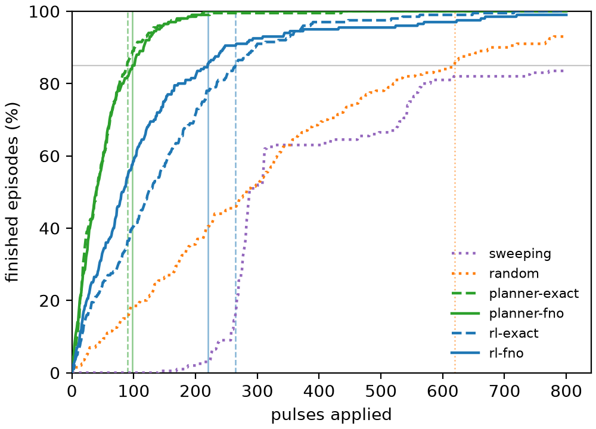
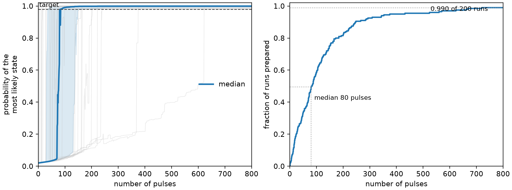

# Quantum-logic-spectroscopy state-preparation gym

This is the code for running and developing the ML techniques for QLS state preparation,
the initial basis is (https://arxiv.org/pdf/2608.03702).

The package is structured as a Gymnasium environment and with access to the effective
Hamiltonian and training of neural operators for the dynamic surrogate.
The package is designed to be modular and extensible, allowing for integration of
 new molecules, action libraries, and dynamics surrogates.

Currently we support the ThF⁺ and H₃O⁺ molecules, and the exact, CUDA-Q or FNO dynamics engines.

## The problem

A molecular ion sits in a thermal mixture over its hyperfine states.
The agent applies Raman sideband pulses (`sigma`, `omega`, `tau`); a logic ion
then reads out `nu = 0` or `nu >= 1`. The belief over molecular populations is
Bayes-updated to the corresponding branch, sampled from the belief's own
predictive distribution (arXiv:2410.11839 Sec. II.2).

The episode ends when one population reaches
`p_target` (purity, default 0.98) or after `max_pulses` pulses.

## Hamiltonian Generation and analysis

This repo uses the effective Hamiltonian for the ThF⁺, to generate your Hamiltonian,
and for further details:

https://github.com/arianjad/heff/tree/main

## Install

```bash
source scripts/env.sh
```

Sets `QLSGYM_ROOT`, `QLSGYM_WORK` (caches; defaults to
`../CACHE`, and
`pip install -e .[gym,fno]` for `gymnasium` and `neuraloperator`/`tensorly`.

## Quickstart

For the exact dynamics:

```python
from qlsgym import load_molecule
from qlsgym.physics.engines import ExactEngine
from qlsgym.env.actions import ActionLibrary
from qlsgym.env.cache import build_action_tables
from qlsgym.env.env import PurificationEnv

mol = load_molecule("thf")                          # or "h3o"
library = ActionLibrary.physics_subset(mol)          # or ActionLibrary(mol) for the full grid
tables = build_action_tables(mol, library)           # engine=None -> qlsgym.physics
env = PurificationEnv(mol, library, tables, batch=64)
transition = env.step(env.torch.randint(0, library.n_actions, (64,)))
```

For the FNO surrogate (instead of exact propagation):

```python
import numpy as np
from qlsgym.surrogate.manifest import load_manifest

engine = load_manifest(mol, "mix")                   # FnoEngine
belief = np.full(mol.n_states, 1 / mol.n_states)
p0, p1 = engine.branches_all_tau(belief, mol.trap.nu_f, "+")   # (n_tau, n_states) each
```

The code also integrates several engines for the dynamics:

|---|---|
| `ExactEngine` | `eigh` of each block Hamiltonian, then `U(tau)` for the whole tau grid |
| `CudaqEngine` | `cudaq.evolve` on the `dynamics` (cuDensityMat) |
| `FnoEngine` | the trained surrogate, with one of the above as fallback |


To select one:

```python
from qlsgym.physics.engines import select_engine

engine = select_engine(mol, tau_indices)       # CUDA-Q if it can run here, else exact
engine.selection            # {'requested': 'auto', 'selected': ..., 'reason': ...}
```

A single-trajectory Gymnasium env (`pip install qlsgym[gym]`):

```python
from qlsgym.env.gym import QLSGymEnv
gym_env = QLSGymEnv(mol, library, tables)
obs, info = gym_env.reset(seed=0)
```

Reference policies and Monte-Carlo evaluation:

```python
from qlsgym.policies.baselines import PhysicsEliminationPolicy, ScorePlannerPolicy
from qlsgym.policies.rollout import rollout

result = rollout(env, PhysicsEliminationPolicy(library))   # or rollout(engine, policy, library=library)
print(result.summary())
```

## Benchmark

We played with a few benchmarks to then keep deveoping over:

One plot, six methods, the comparison of arXiv:2410.11839 Fig. 4c / Fig. S7:
the percentage of finished episodes against the number of pulses applied.

```bash
source scripts/env.sh
python scripts/benchmark.py run  h3o sweeping         # ~minutes
python scripts/benchmark.py run  h3o planner-fno      #
python scripts/benchmark.py run  h3o rl-fno --device cuda
python scripts/benchmark.py plot h3o                  # OUTPUTS/benchmark/h3o/finished.{png,pdf}
python scripts/benchmark.py table h3o
```

### ThF+ `mix` FNO reproduction on Tara

The 24-checkpoint [`munozariasjm/thf_qls_fno`](https://huggingface.co/munozariasjm/thf_qls_fno)
manifest was evaluated on an NVIDIA H100 PCIe at commit `2a7ee18`.  The protocol uses the
312-action `physics_subset` library, target purity 0.98, an 800-pulse horizon and 200 exact-table
evaluation episodes.  PPO uses two million training transitions, training seed 0 and sampled
policy evaluation.  The horizon and evaluation mode must be explicit: ThF+'s repository default
is 80 pulses, and `PPOConfig.eval_greedy` defaults to `True`.

| controller | exact-evaluation success | mean pulses | P85 |
|---|---:|---:|---:|
| planner-exact | 1.000 | 50.8 | 90 |
| planner-fno | 1.000 | 51.3 | 98 |
| PPO-exact | 1.000 | 150.2 | 265 |
| PPO-fno | 0.990 | 124.0 | 220 |
| random | 0.930 | 323.4 | 619 |
| sweeping | 0.835 | 416.6 | not reached |



The planner pair closely reproduces the model-card result (exact/FNO: 53.1/51.3 mean pulses,
both 100% successful).  Fresh PPO runs reproduce the high-success conclusion but outperform the
model-card pulse counts; one training seed is not an exact numeric reproduction of a saved actor.
The PPO-FNO completion curve has 99.0% final completion and an 80-pulse median among successful
episodes.



Run the PPO-FNO arm with:

```bash
export QLSGYM_WORK=/path/to/qlsgym_work
python scripts/benchmark.py run thf rl-fno \
  --device cuda --fno-tag mix --n-episodes 200 --seed 777 \
  --max-pulses 800 --p-target 0.98 \
  --ppo total_steps=2000000 --ppo seed=0 --ppo eval_greedy=false
```

All six JSON records, the merged completion curves and PDF figures are under
[`OUTPUTS/benchmark/thf`](OUTPUTS/benchmark/thf).  `scripts/thf_reproduction_figures.py` regenerates
the slide-style figures from the records and the selected PPO-FNO actor.

For this fixed action library, exact PPO uses cached transfer tables rather than an `eigh` per
pulse.  On Tara, end-to-end PPO-exact took 72.5 s and PPO-FNO took 1073.7 s, so the surrogate was
14.8 times slower than cached exact dynamics in this workload.  The FNO remains useful when the
control set changes or cannot be precomputed.  Planner timing is not directly comparable because
the exact reference was vectorized over cached actions and the FNO evaluation was split into three
Monte Carlo shards.

## Repo structure

```
src/qlsgym/
  spec.py          the contract: Molecule, Block, TauBatchedEngine
  molecules/       h3o, thf, synthetic -- build a Molecule from data/
  physics/         exact dynamics: hamiltonian, propagate, spectrum, engines, cudaq_engine
  surrogate/       FNO: embedding, model, dataset, train, manifest, in-loop engine
  env/             action library, transfer-matrix cache, PurificationEnv, gym wrapper
  policies/        sweeping, physics elimination, score planner, rollout driver
  rl/              PPO
  benchmark/       arm protocol, finished-episodes curve, figure

data/              level energies and two-photon Rabi rates (h3o, thf)
scripts/           env.sh, train_fno.py, make_manifest.py, benchmark.py, slurm/
examples/          01 env, 02 baselines, 03 FNO engine
tests/             pytest suite
replication/       arXiv:2608.03702 walkthrough; deletable, not part of qlsgym
OUTPUTS/           benchmark and replication results (JSON + figures)
```

Caches, training splits go to `$QLSGYM_WORK`.
