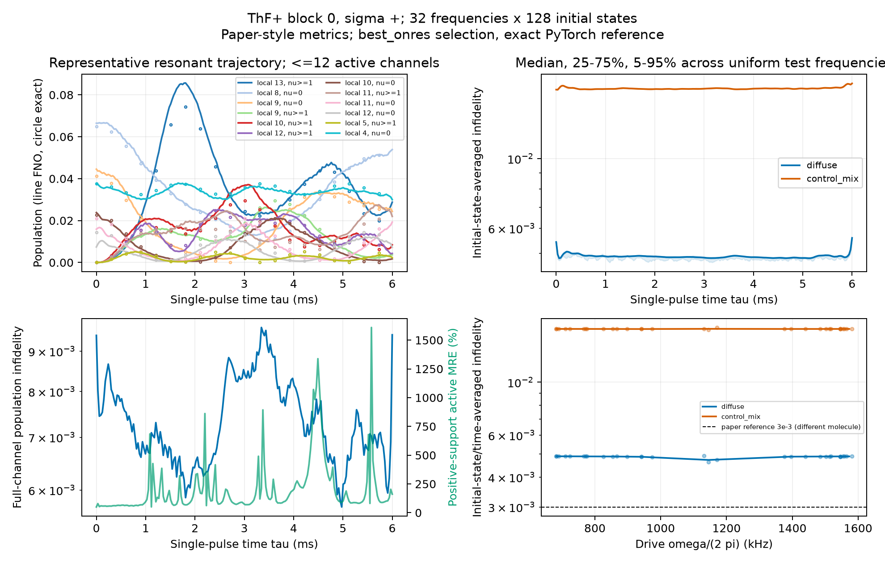
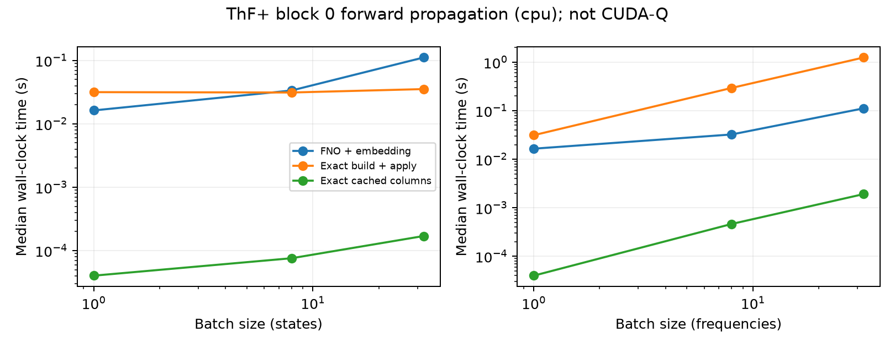
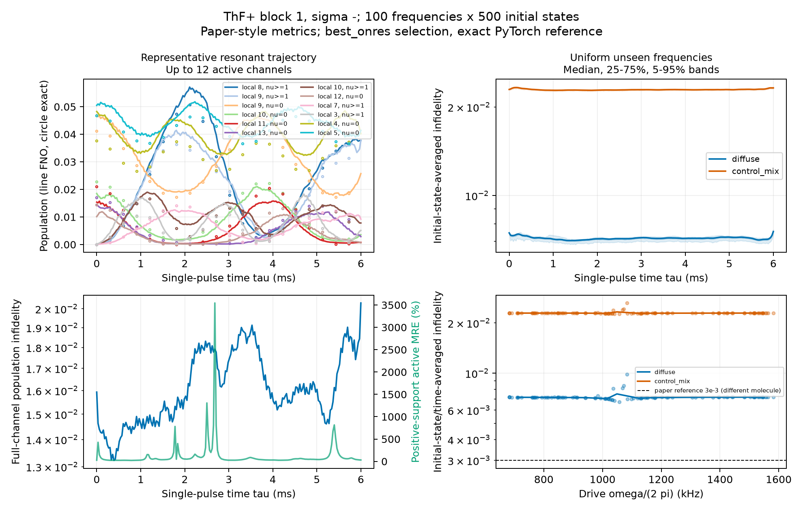
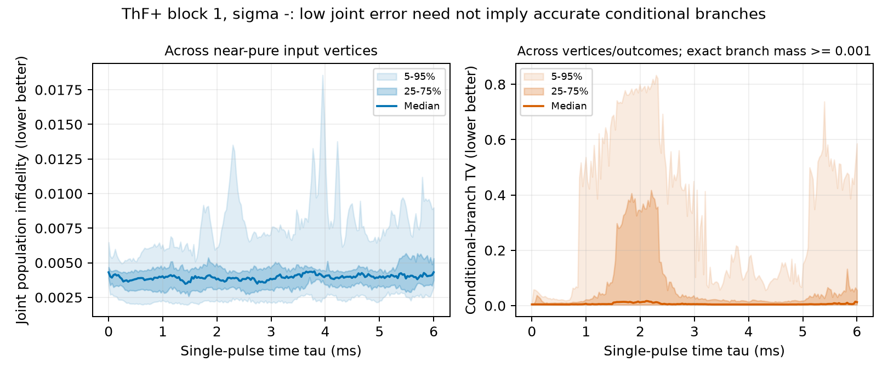
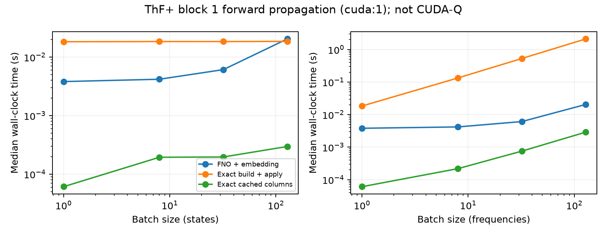
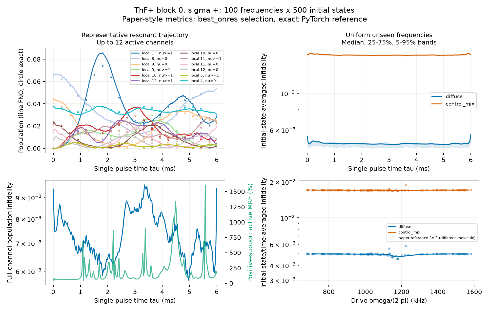
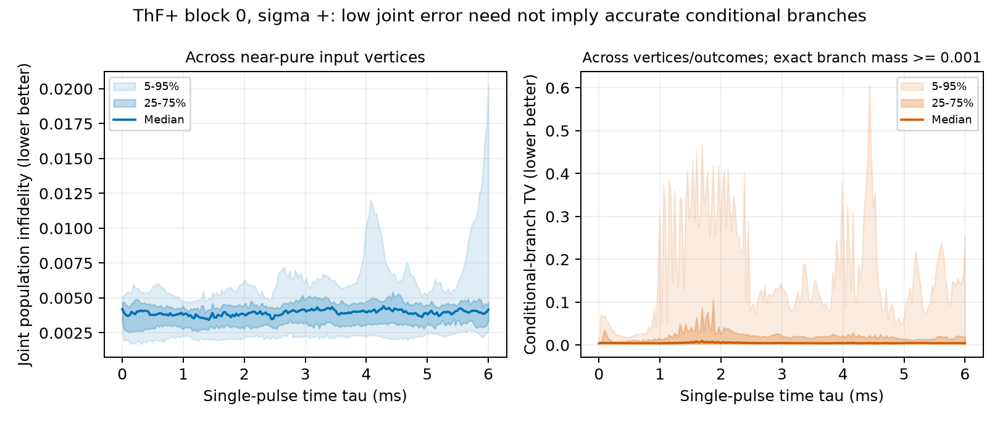
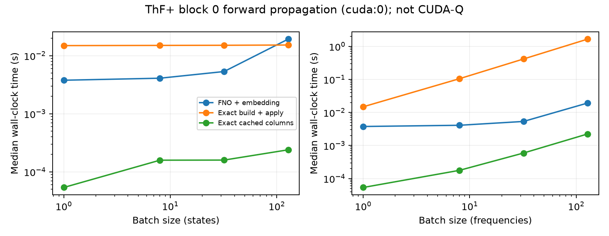
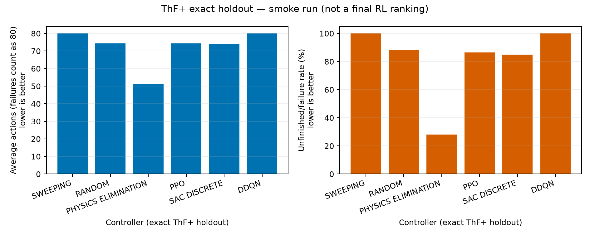

# ThF⁺ quantum-logic spectroscopy: FNO surrogates and RL

This branch studies **ThF⁺ state purification** using a Fourier neural operator (FNO) transition surrogate and PPO, categorical SAC and Double DQN. It adapts accuracy, timing and finished-episode metrics from [arXiv:2608.03702](https://arxiv.org/pdf/2608.03702), not that paper's molecule or hardware.

Native qlsgym branch **FNO_RL_agents**, based on main commit 2a7ee186f09c54b78d5987bcd0a6bb2399749e28. Experiment code and historical FNO results were selectively transferred from [the earlier RL branch](https://github.com/HHTseng/rl_qls_paper_replication/tree/FNO_RL_agents), commit d306d34; unrelated experiments were not merged. The underlying library remains intact.

## Current conclusions — completed 17 September 2026

All **24/24 production FNO models**, two full GPU paper-style audits, and **15/15 learned-agent runs** are complete. PPO, SAC and DDQN each have five training seeds at approximately one million transitions per seed; all 18 controllers have 5000 exact and 5000 FNO evaluation episodes. The server's final test run passed **166 tests** (17 skipped, three deselected). No further GPU jobs were started for this analysis.

- **Physics elimination is strongest:** exact failure 29.36%, average actions 51.49. SAC reaches 71.69%/66.83; PPO 76.75%/69.07. Both learned averages improve over random, but neither approaches physics elimination.
- **SAC is not a statistically established winner over PPO.** Five-seed confidence intervals overlap; SAC seed 4 fails 99.48% of exact episodes, versus 56.06–71.44% for its other seeds. Report every seed, not just the best checkpoint/seed. SAC also optimizes a different discounted soft objective.
- **DDQN failed all 25,000 exact episodes.** Nonzero exploratory training success did not translate to a successful deployed greedy policy. This is a failure of the tested configuration, not proof that DDQN cannot solve the task.
- **FNO accuracy is not closed-loop certification.** Physics elimination fails 71.76% under FNO but only 29.36% exactly: a 42.40-percentage-point pessimistic surrogate gap. Conditional-branch and identity errors remain material; block 11, σ=+, is a distinct accuracy outlier.
- **Speed depends on amortization:** FNO is approximately 86–103× faster for fresh 128-frequency batches in the two audited blocks, but cached exact propagation is approximately 7–80× faster across tested workloads. These are block propagation timings, not end-to-end RL speedups.

See the [detailed final analysis](docs/THF_FINAL_ANALYSIS.md), [complete report](docs/THF_RESULTS.md), and exact ranking below. Lower failure and failure-penalized average actions are better.

## Physics and environment

| Quantity | ThF⁺ experiment |
|---|---|
| Molecular belief | $s\in\Delta^{191}$: 192 states, 12 Hamiltonian blocks |
| Motional truncation | 7 levels; Hilbert dimension $192\times7=1344$ |
| Measured outcomes | $k=0$: ground; $k=1$: all excited motional levels |
| Initialization | Thermal populations, 4 K |
| Controls | 312 actions: 288 Raman $(\sigma,\omega,\tau)$ + 24 primitives |
| Pulse duration | 200-time FNO grid, maximum 6 ms |
| Episode | $\max_i s_i\ge0.98$ target; $H=80$ actions; $\rho=0$ |
| Dynamics | FNO Raman propagation; primitives exact; final ranking evaluated exactly |

The environment carries **populations, not coherences**: each pulse starts from a diagonal molecular mixture with the motion in its ground state. Posterior populations after readout/cooling define the next input. “Exact” below means exact within this effective-Hamiltonian, seven-level, population-reset model, not experimental certification.

For action $a$, define unnormalized branch population $u_k(s,a)\ge0$, Born probability $\pi_k=\sum_i u_{k,i}$ and conditional belief $s'_k=u_k/\pi_k$. The quantum belief MDP has

$$P(s'|s,a)=\sum_{k=0}^1\pi_k(s,a)\delta(s'-s'_k),\qquad \sum_k\pi_k=1.$$

For a block with $m_f$ states, FNO maps $(s_f,\omega,\sigma)$ to joint populations in $\Delta^{2m_f-1}$ at all pulse times. Two readout groups do **not** mean a two-level motional Hamiltonian. Effective Hamiltonian construction: [heff](https://github.com/arianjad/heff/tree/main).

### Sampled versus branch-expected updates

Let $c_k=1$ only when branch $k$ is nonterminal and budget remains. Write $Q(s,a)$ for action value, $V(s)$ for the appropriate next-state value (maximum-Q for Q-learning), $r_k$ for branch reward, $\gamma$ for discount and $\eta$ for learning rate. The [earlier RL paper](https://arxiv.org/pdf/2410.11839) motivates these S17-style sampled and S18-style branch-expected targets, with terminal/budget masks:

$$\text{S17:}\quad y=r_K+\gamma c_KV(s'_K),\quad K\sim\{\pi_k\};\qquad Q\leftarrow Q+\eta(y-Q),$$

$$\text{S18:}\quad y=\sum_{k=0}^1\pi_k[r_k+\gamma c_kV(s'_k)];\qquad Q\leftarrow Q+\eta(y-Q).$$

They represent the same expected physical Bellman operator with correct branches. Branch expectation reduces measurement-sampling variance; it does **not** fix FNO bias. DDQN uses online-action selection/target-Q evaluation, SAC a soft value, and PPO a branch-expected critic residual inside sampled-trajectory GAE. [Full protocol](docs/THF_FINAL_RL_STUDY.md).

## Install and reproduce

Python≥3.11, PyTorch≥2.3. Production runs use conda environment /home/htseng/anaconda3/envs/qlsgym on wcs164084 (two RTX 2080 Ti, 11 GiB each).

    python -m pip install -e '.[gym,fno,analysis,test]'
    export QLSGYM_WORK=/path/to/qlsgym_work
    export PYTHONPATH="$PWD/src"
    python -m pytest -q -m 'not slow'

Exact environment:

    import torch
    from qlsgym import load_molecule
    from qlsgym.env.actions import ActionLibrary
    from qlsgym.env.cache import build_action_tables
    from qlsgym.env.env import EnvConfig, PurificationEnv

    mol = load_molecule("thf")
    library = ActionLibrary.physics_subset(mol)
    tables = build_action_tables(mol, library, device="cpu")
    env = PurificationEnv(mol, library, tables,
                          EnvConfig(p_target=0.98, max_pulses=80), batch=64)
    state = env.reset(seed=0)
    transition = env.step(torch.randint(library.n_actions, (64,)))

Train one long FNO pair and independently test it:

    python scripts/prepare_thf_fno.py train-block --work "$QLSGYM_WORK" \
      --preset long --tag rlprod120v2 --block 0 --sigma + --device cuda:0 --storage-device cpu
    python scripts/prepare_thf_fno.py evaluate-block --work "$QLSGYM_WORK" \
      --tag rlprod120v2 --block 0 --sigma + --device cuda:0

Repeat for all 12 blocks and both polarizations, then assemble the full manifest:

    python scripts/prepare_thf_fno.py manifest --work "$QLSGYM_WORK" \
      --tag rlprod120v2 --sigmas both --device cpu

Paper-style tests and the **full** RL grid were coordinated by scripts/run_thf_final_study.sh in tmux and completed on 17 September 2026. The pipeline validates results, redraws figures, refreshes this README/report, tests and commits. Its server-side push encountered a GitHub DNS failure; the completed commit was recovered locally for publication. For a new study, use a distinct run generation rather than overwriting these locked results. [Execution details](docs/THF_FINAL_RL_STUDY.md).

<!-- FNO_RESULTS_START -->
## Production FNO accuracy

Completed checkpoints with independent held-out tests: **24/24**. All completed models trained for 120 epochs; checkpoints are preselected `best_onres.pt`, never test-selected.

| Block | σ | On-resonance median infidelity, diffuse ↓ | On-resonance median, control mixture ↓ | Control-mixture P95 ↓ | Static/no-change median |
|---:|:---:|---:|---:|---:|---:|
| 0 | + | 0.00622 | 0.02051 | 0.02180 | 0.17603 |
| 1 | + | 0.00594 | 0.02051 | 0.02131 | 0.19463 |
| 2 | + | 0.00424 | 0.01245 | 0.01309 | 0.14371 |
| 3 | + | 0.00388 | 0.01345 | 0.01431 | 0.15958 |
| 4 | + | 0.00207 | 0.00613 | 0.00646 | 0.10285 |
| 5 | + | 0.00205 | 0.00647 | 0.00685 | 0.11909 |
| 6 | + | 0.00117 | 0.00360 | 0.00411 | 0.06656 |
| 7 | + | 0.00111 | 0.00346 | 0.00382 | 0.06888 |
| 8 | + | 0.00049 | 0.00145 | 0.00171 | 0.04142 |
| 9 | + | 0.00045 | 0.00150 | 0.00169 | 0.04153 |
| 10 | + | 0.00020 | 0.00040 | 0.00046 | 0.06502 |
| 11 | + | 0.04455 | 0.05790 | 0.07685 | 0.06502 |
| 0 | - | 0.00578 | 0.01864 | 0.01937 | 0.15703 |
| 1 | - | 0.00817 | 0.02600 | 0.02715 | 0.17144 |
| 2 | - | 0.00368 | 0.01141 | 0.01224 | 0.12984 |
| 3 | - | 0.00429 | 0.01362 | 0.01443 | 0.14811 |
| 4 | - | 0.00202 | 0.00648 | 0.00691 | 0.09330 |
| 5 | - | 0.00174 | 0.00595 | 0.00630 | 0.10941 |
| 6 | - | 0.00113 | 0.00316 | 0.00358 | 0.05713 |
| 7 | - | 0.00104 | 0.00322 | 0.00368 | 0.05737 |
| 8 | - | 0.00044 | 0.00131 | 0.00167 | 0.04071 |
| 9 | - | 0.00046 | 0.00129 | 0.00160 | 0.04093 |
| 10 | - | 0.00014 | 0.00036 | 0.00126 | 0.05233 |
| 11 | - | 0.00016 | 0.00034 | 0.00038 | 0.05233 |

Each row uses 32 new frequencies per stratum × 128 initial states, seeds 20260916/17, with 200 single-pulse time samples. Values average over initial states and pulse times before computing frequency percentiles. Diffuse and peaked input ensembles are not interchangeable.

Accuracy on resonance improved strongly over the 30-epoch pilot, but a few-percent error floor remains on peaked beliefs. Off-resonance static predictions can outperform FNO; small unconditional error does not guarantee accurate normalized measurement branches or closed-loop purification.

### Preliminary CPU audit: block 0, σ=+

32 new frequencies/stratum × 128 initial states; device `cpu`. Reference: exact PyTorch, not CUDA-Q.

- Representative resonant trajectory: time-average population infidelity 0.0073515.
- Zero-time identity total-variation error: 0.052159 (ideal 0).
- Near-pure input mean/P95 infidelity: 0.0041929/0.005594.
- Near-pure conditional-branch P95 TV: 0.21304, excluding exact branch masses <10⁻³.
- Input-mixture linearity TV: 0.04103 (ideal 0).

Exact-build/FNO speedup range: 0.32–11.15×; cached-exact/FNO: 0.00153–0.0171×. These compare different amortization regimes, not the paper's CUDA-Q benchmark.

### Full paper-style audit: block 1, σ=-

100 new frequencies/stratum × 500 initial states; device `cuda:1`. Reference: exact PyTorch, not CUDA-Q.

- Representative resonant trajectory: time-average population infidelity 0.016159.
- Zero-time identity total-variation error: 0.067162 (ideal 0).
- Near-pure input mean/P95 infidelity: 0.004456/0.0065554.
- Near-pure conditional-branch P95 TV: 0.50592, excluding exact branch masses <10⁻³.
- Input-mixture linearity TV: 0.027968 (ideal 0).

Exact-build/FNO speedup range: 0.91–103.15×; cached-exact/FNO: 0.0145–0.141×. These compare different amortization regimes, not the paper's CUDA-Q benchmark.

### Full paper-style audit: block 0, σ=+

100 new frequencies/stratum × 500 initial states; device `cuda:0`. Reference: exact PyTorch, not CUDA-Q.

- Representative resonant trajectory: time-average population infidelity 0.0073515.
- Zero-time identity total-variation error: 0.052159 (ideal 0).
- Near-pure input mean/P95 infidelity: 0.0041929/0.005594.
- Near-pure conditional-branch P95 TV: 0.21304, excluding exact branch masses <10⁻³.
- Input-mixture linearity TV: 0.04103 (ideal 0).

Exact-build/FNO speedup range: 0.79–85.98×; cached-exact/FNO: 0.0124–0.116×. These compare different amortization regimes, not the paper's CUDA-Q benchmark.

The CPU preview finds 5.2% zero-time identity TV, 4.1% input-linearity TV, and conditional-branch P95 TV ≈21% despite near-pure mean joint infidelity ≈0.0042. Large MRE spikes are driven by small positive true populations; infidelity and absolute/TV diagnostics give complementary context. Low joint error is not a closed-loop certification.

For fixed-frequency state batches, exact propagation amortizes one eigendecomposition over many input states. Fresh frequency batches reach up to 11.2× FNO speedup, but cached exact is 58–655× faster across tested workloads. These CPU timings do not predict GPU timings; full audits log those separately. A compact fixed312-action problem can favor exact tables; FNO's stronger motivation is larger or changing/continuous control sets.
<!-- FNO_RESULTS_END -->

<!-- FINAL_RL_RESULTS_START -->
## Final exact-simulator ranking

Complete locked grid: 15 learned policies and three baselines. Each policy has 5000 exact and 5000 surrogate rollouts.

| Controller | Training seeds | Exact average actions ↓ (95% CI) | Exact failure ↓ (95% CI) | FNO average actions | FNO failure |
|---|---:|---:|---:|---:|---:|
| Physics elimination | 0 | 51.49 [50.78, 52.22] | 29.36% [28.11, 30.64] | 69.20 | 71.76% |
| Discrete SAC | 5 | 66.83 [62.10, 73.37] | 71.69% [61.18, 86.19] | 68.19 | 73.44% |
| PPO | 5 | 69.07 [67.17, 70.97] | 76.75% [73.14, 80.36] | 69.80 | 77.21% |
| Random | 0 | 74.57 [74.11, 75.01] | 85.62% [84.62, 86.57] | 76.18 | 88.46% |
| Sweeping | 0 | 79.97 [79.94, 80.00] | 99.92% [99.79, 99.97] | 79.93 | 99.82% |
| Double DQN | 5 | 80.00 [80.00, 80.00] | 100.00% [100.00, 100.00] | 79.86 | 99.60% |

Order is descriptive: exact failure rate, then average actions. PPO/DDQN use γ=1; SAC uses γ=0.99 with an entropy bonus, so these are operational performance scores, not equal training objectives.

Learned-policy intervals bootstrap five training-seed means; baseline mean intervals bootstrap rollouts and failure intervals use Wilson bounds. Five seeds do not establish statistical dominance. Inspect individual JSONs and the FNO-to-exact gap before interpreting a learned advantage.
<!-- FINAL_RL_RESULTS_END -->

## Metric interpretation

Let $T_j$ be first successful pulse count ($\infty$ if unfinished), $L_j=\min(T_j,H)$, and $N$ rollout count. Early stopping without success still scores failure and $H$.

$$f=1-\frac1N\sum_j\mathbf1\{T_j\le H\},\qquad
A=\frac1N\sum_jL_j,\qquad C(h)=\frac1N\sum_j\mathbf1\{T_j\le h\}.$$

**Failure rate $f$ and average actions $A$: lower better; finished-episode curve $C(h)$: higher better.** Average actions is failure-penalized, not successful-only mean. P85 and worst-10% CVaR of $L$ are lower-better tail metrics, often saturated at80 when failure is high.

Population infidelity $I_p=1-(\sum_b\sqrt{p_b\widehat p_b})^2$: **lower better**, measuring populations, not coherence. Near-pure, identity and conditional-branch errors matter for repeated purification. Speedup $T_{\rm exact}/T_{\rm FNO}$: **higher faster**, but fresh propagation and cached tables are different references. [Precise definitions](docs/FNO_PAPER_METRICS.md).

## Historical pilot — not a final ranking

30-epoch low-width FNO, only8192 training transitions, one seed,200 holdout episodes:

| Controller | Exact average actions ↓ | Exact failure ↓ | FNO average actions | FNO failure |
|---|---:|---:|---:|---:|
| Physics elimination | 51.455 | 28.0% | 80.000 | 100.0% |
| Random | 74.315 | 88.0% | 78.595 | 97.0% |
| PPO | 74.255 | 86.5% | 74.010 | 84.5% |
| Discrete SAC (old temperature) | 73.860 | 85.0% | 77.140 | 93.5% |
| Double DQN | 80.000 | 100.0% | 79.720 | 99.5% |
| Sweeping | 80.000 | 100.0% | 80.000 | 100.0% |

No learned advantage was established. Physics elimination's exact/FNO discrepancy exposed invalid pilot dynamics. Fixed-order sweeping visits only the first80/312 controls before timeout, missing all primitives; it is an order-dependent reference, not optimal sweeping. Raw pilot JSONs are retained for provenance, never pooled with new scores.

## Reports and next work

- [Detailed numerical report](docs/THF_RESULTS.md), [paper-style audit](docs/FNO_PAPER_METRICS.md), [locked RL study](docs/THF_FINAL_RL_STUDY.md).
- Completed: all production models, five-seed learned grid, exact ranking and full GPU audits. Next: investigate SAC seed collapse and DDQN greedy-policy failure; run exact-trained controls and validate the block-11 σ=+ outlier before extending training or tuning.
- If peaked/conditional errors persist, train on exact collected beliefs/vertices and test identity/linearity constraints, not just more epochs.
- Add remaining-budget observations; compare exact-trained RL and stronger full-library sweeping schedules.
- Tune hyperparameters only on separate validation seeds after checking model validity; keep final holdout locked. Match discounts for equal-objective claims.

The library lives under src/qlsgym/{molecules,physics,surrogate,env,policies,rl}; scripts/ holds experiments, tests/ correctness checks, results/ JSON/NPZ/figures. Weights, datasets, caches and logs are not committed.
