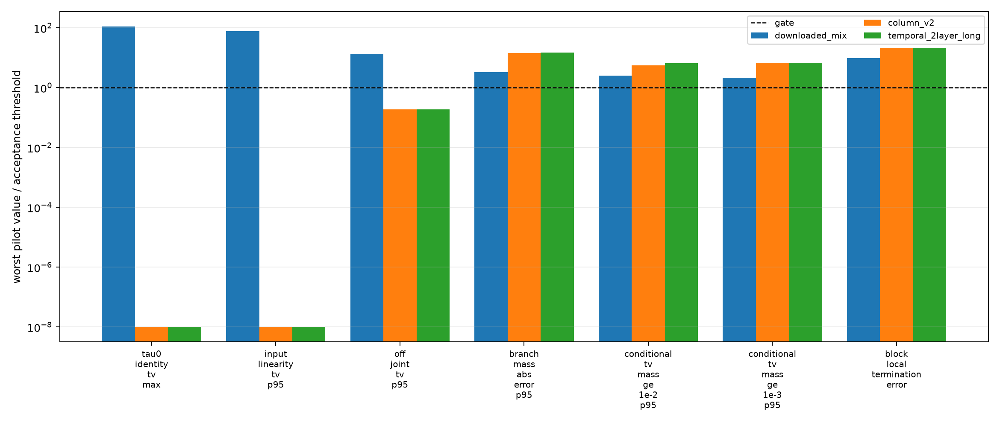
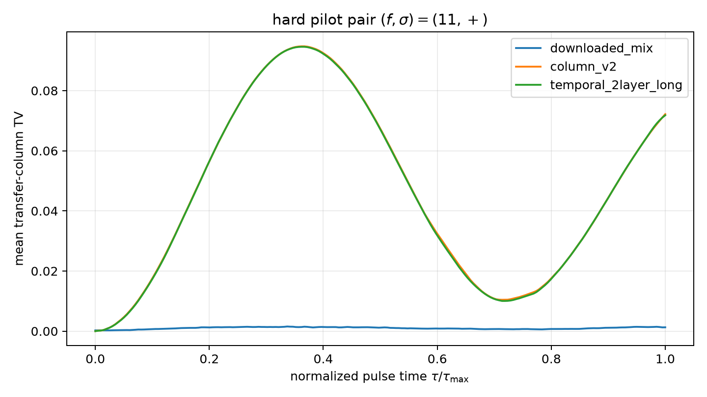

# Temporal FNO for ThF⁺ quantum-logic control

`seqFNO_RL` tests whether attention along the physical pulse-time coordinate
improves the ThF⁺ dynamics surrogate used by reinforcement-learning agents. It
branches from `FNO_RL_optuna` and uses the downloaded
[`munozariasjm/thf_qls_fno`](https://huggingface.co/munozariasjm/thf_qls_fno)
manifest only as a reference model. All new training targets are exact
effective-Hamiltonian transfer columns.

The result is negative at the promotion boundary: temporal attention improves
four ordinary block/polarization pairs, but it does not correct the two
branch-critical pairs. The model was therefore not promoted to a 24-pair FNO
or to RL training.

## Operator and constraints

The sequence coordinate is coherent time within one pulse,
$\tau\in[0,\tau_{\max}]$. It is distinct from the RL decision index
$t\in\{0,\ldots,H\}$. For Hamiltonian block $f$, polarization $\sigma$,
frequency $\omega$, measurement branch $k\in\{0,1\}$, and block population
$s_f\in\Delta^{M_f-1}$, the surrogate learns

$$
B^{(f)}_{(\omega,\tau,\sigma),k}
\in\mathbb R_{\geq0}^{M_f\times M_f},
\qquad
v_k=B^{(f)}_{(\omega,\tau,\sigma),k}s_f.
$$

The branch mass and posterior are

$$
p_k=\mathbf 1^{\mathsf T}v_k,
\qquad
s'_k=\frac{v_k}{p_k}.
$$

The architecture applies a spectral trunk, continuous Fourier time embedding,
and a gated pre-norm Transformer along the 200-point $\tau$ grid. The output
construction enforces

$$
B_{(\omega,0,\sigma)}=
\begin{bmatrix}I_{M_f}\\0\end{bmatrix},
\qquad
B_{(\omega,\tau,\sigma)}\geq0,
\qquad
\mathbf 1^{\mathsf T}B_{(\omega,\tau,\sigma)}=\mathbf 1^{\mathsf T}.
$$

Thus zero-time identity, positivity, probability conservation, and linearity in
$s_f$ hold by construction. Off-resonance pulses use the exact static map.

## Evaluation contract

The hard pilot contains

$$
\mathcal P=\{(0,+),(0,-),(1,+),(1,-),(9,+),(11,+)\}.
$$

A pair passes only when all seven structural and branch-aware gates pass:
zero-time identity, input linearity, off-resonance joint error, branch-mass
error, conditional-posterior error at two probability cutoffs, and local
termination error. Promotion requires all six pairs to pass. Candidate
selection never uses RL returns.

The matched comparison used identical audit samples for the downloaded `mix`,
the structured `column_v2` baseline, and the two-layer temporal FNO. Lower is
better.

| Model | Pairs passing all gates | Worst branch-mass P95 | Worst conditional-TV P95 | On-resonance spectral error |
|---|---:|---:|---:|---:|
| Downloaded `mix` | 0/6 | **0.01659** | **0.12558** | 0.000199 |
| Structured `column_v2` | 2/6 | 0.07254 | 0.27775 | 0.000259 |
| Temporal FNO, matched budget | **4/6** | 0.07532 | 0.32937 | **0.000172** |

Temporal attention makes all four block-0 and block-1 pairs pass. The remaining
failures are scientifically material:

| Pair | Failed quantity | Temporal result | Gate |
|---|---|---:|---:|
| $(9,+)$ | termination error | 0.01478 | 0.005 |
| $(11,+)$ | branch-mass P95 | 0.07532 | 0.005 |
| $(11,+)$ | conditional-TV P95 | 0.32937 | 0.05 |

Derivative and spectral auxiliary losses did not repair these errors. A pure
Transformer was worse. Shuffling the time order improved some fixed-grid
scores while degrading derivative and spectral metrics, which identifies grid
memorization rather than learned physical ordering. The trained attention gate
remained small, with median $g=0.0775$ from initialization $g=0.075$.





## RL consequence

Because the surrogate failed the preregistered gate, no temporal-FNO PPO or SAC
score is reported. Training a controller on it would confound policy quality
with known branch bias. The retained exact-dynamics references from
`FNO_RL_optuna` are:

| Controller | Exact unfinished fraction | Failure-penalized actions |
|---|---:|---:|
| Physics elimination | **29.36%** | 51.49 |
| Optimized PPO | 41.78% | **51.37** |
| Refined SAC | 57.07% | 59.85 |

The next surrogate revision should target block-conditioned branch mass and
posterior accuracy, especially block 11/+, before adding capacity or retraining
RL.

## Reproduce

Python 3.11 or newer and PyTorch 2.3 or newer are required. On Tara:

```bash
cd /home/htseng/qlsgym_seqFNO_RL
source /usr/local/anaconda3/etc/profile.d/conda.sh
conda activate qlsgym
export QLSGYM_WORK=$HOME/qlsgym_work
export PYTHONPATH=$PWD/src

GPU0=0 GPU1=2 bash scripts/run_thf_temporal_fno_pilot.sh
GPU0=0 GPU1=2 bash scripts/run_thf_temporal_fno_refinement.sh
GPU0=0 GPU1=2 bash scripts/run_thf_temporal_fno_long_pilot.sh
GPU0=0 GPU1=2 bash scripts/run_thf_temporal_baseline_audit.sh
python scripts/summarize_thf_temporal_final.py
```

The launchers use GPUs 0 and 2 with at most one process per GPU. The study
trained 48 models in an estimated 1.97 GPU-hours. The non-slow test suite
reported 177 passed, 17 skipped, and three deselected.

## Repository map

- [`src/qlsgym/surrogate/temporal_fno.py`](src/qlsgym/surrogate/temporal_fno.py): temporal architecture and physical constraints.
- [`src/qlsgym/surrogate/column_train.py`](src/qlsgym/surrogate/column_train.py): exact-column training and auxiliary losses.
- [`scripts/audit_thf_fno_manifest.py`](scripts/audit_thf_fno_manifest.py): structural, branch, derivative, and spectral audit.
- [`docs/THF_TEMPORAL_FNO_STUDY.md`](docs/THF_TEMPORAL_FNO_STUDY.md): complete protocol and pairwise interpretation.
- [`results/thf_temporal_fno_study/`](results/thf_temporal_fno_study): compact final contract, summary, and figures.

Checkpoints and generated audit directories live under `$QLSGYM_WORK` and are
not committed.
