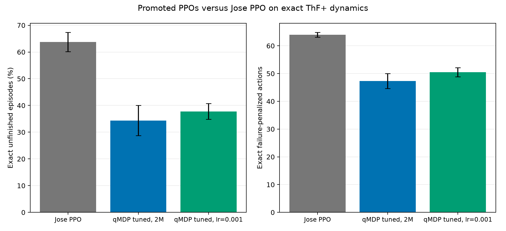
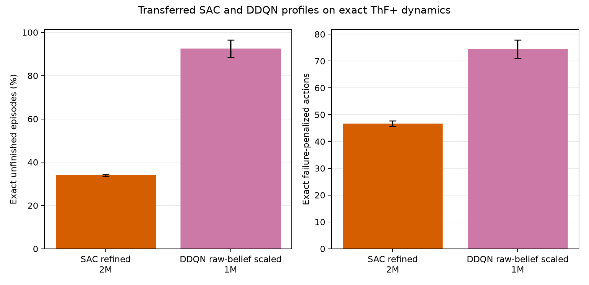

# ThF⁺ control with a downloaded FNO

This branch trains PPO, categorical SAC, and Double DQN for ThF⁺ state
purification using the fixed `munozariasjm/thf_qls_fno` `mix` surrogate. The
strongest completed learned controller is **refined SAC**: on exact dynamics it
has **33.93% failure** and **46.70 failure-penalized actions**. The qMDP PPO is
statistically close at 34.35% and 47.28, while Jose PPO gives 63.74% and 63.98.

## Control and evaluation contract

The molecular belief is a probability vector

$$
s_t \in \Delta^{191}
= \lbrace s \in \mathbb{R}_{\geq 0}^{192}: \sum_{i=1}^{192}s_i=1 \rbrace.
$$

The action set $\mathcal{A}$ contains 288 Raman pulses and 24 primitive
operations. For $a_t\in\mathcal{A}$, measurement branch $k\in\lbrace0,1\rbrace$
has unnormalized population $u_{t,k}$, Born probability $\pi_{t,k}$, and
posterior state

$$
\pi_{t,k}=\sum_i u_{t,k,i},
\qquad
s'_{t,k}=\frac{u_{t,k}}{\pi_{t,k}},
\qquad
\sum_{k=0}^{1}\pi_{t,k}=1.
$$

The environment samples an action and advances the molecular state according to

$$
K_t\sim\pi_t,\qquad s_{t+1}=s_{t,K_t}^{\prime}.
$$

An episode succeeds when

$$
\lVert s_t\rVert_\infty\geq 0.98,
$$

and otherwise stops at $H=80$. All reported experiments use $\rho=0$ and the
24-checkpoint `mix` manifest with fingerprint `d7deb43457d3`.

For episode $j$, let $T_j$ be the first successful time and define
$L_j=\min(T_j,H)$, with $T_j=\infty$ on failure. The exact-dynamics metrics are

$$
f_E=\frac{1}{N}\sum_{j=1}^{N}\mathbf{1}[T_j>H],
\qquad
A_E=\frac{1}{N}\sum_{j=1}^{N}L_j.
$$

Both are lower-better. Each unfinished episode contributes 80 to $A_E$.
Learned rows use five training seeds and, per seed, 5,000 FNO episodes plus a
disjoint 5,000-episode exact audit. Model selection uses only FNO rollouts.

## Audited controller comparison

Values are mean ± sample standard deviation across training seeds. Physics
elimination is one fixed policy evaluated on 5,000 episodes.

| Controller | Training | Exact failure $f_E$ ↓ | Exact actions $A_E$ ↓ | FNO failure ↓ |
|---|---:|---:|---:|---:|
| Physics elimination | none | **29.36%** | 51.49 | 63.14% |
| **Refined SAC** | 2M transitions | 33.93% ± 0.56% | **46.70 ± 1.04** | 32.89% |
| **qMDP PPO** | 2M transitions | 34.35% ± 5.65% | 47.28 ± 2.69 | 31.10% |
| qMDP PPO, lower learning rate | 1M transitions | 37.78% ± 2.93% | 50.52 ± 1.64 | 35.52% |
| Jose PPO | 2M transitions | 63.74% ± 3.64% | 63.98 ± 0.89 | 62.82% |
| Original branch PPO | 1M transitions | 73.89% ± 2.37% | 68.15 ± 1.01 | 73.84% |
| Refined SAC reference | 1M transitions | 57.07% ± 18.96% | 59.85 ± 9.11 | 56.59% |
| Original SAC | 1M transitions | 69.41% | 66.07 | 72.23% |
| Transferred DDQN | 1M transitions | 92.46% ± 3.99% | 74.46 ± 3.37 | 92.56% |
| Original DDQN | 1M transitions | 98.56% | 78.88 | 98.97% |

Refined SAC narrowly improves on qMDP PPO by 0.42 percentage points and 0.59
actions. The seed variation is also smaller: 0.56 percentage points for SAC
versus 5.65 for qMDP PPO. Relative to physics elimination, SAC uses 4.79 fewer
penalized actions but fails 4.57 points more often, so neither controller
dominates the other.

qMDP PPO lowers exact failure by **29.40 percentage points** and $A_E$ by
**16.70 actions** relative to Jose PPO, winning both metrics on all five paired
seeds.

The FNO underestimates refined SAC failure by 1.04 points and qMDP PPO failure
by 3.25 points. This policy-specific agreement does not validate the surrogate
globally: physics elimination has a 33.78-point exact-versus-FNO failure gap.



The numerical records are in the [PPO summary](results/thf_next_ppo/summary.json),
[screen selection](results/thf_next_ppo/selection.json), and
[compact table](results/thf_next_ppo/summary.md).

## Why qMDP PPO works

For both measurement outcomes, the environment can compute the scaled reward
$\widetilde r_{t,k}$, continuation mask $c_{t,k}$, and posterior
$s'_{t,k}$. The selected PPO uses the one-step branch expectation

$$
\overline y_t
=\sum_{k=0}^{1}\pi_{t,k}
\left[\widetilde r_{t,k}+\gamma c_{t,k}V(s'_{t,k})\right],
\qquad
\widehat A_t=\overline y_t-V(s_t).
$$

Thus the actor and critic use both physically possible measurement branches,
rather than a sampled one-step target. This removes measurement-outcome noise
from the local Bellman target. The winning configuration is

| Quantity | Value |
|---|---:|
| Transitions | 2,000,000 |
| Environments × rollout length | $128\times32$ |
| Network | $192\to512\to(312,1)$ |
| Learning rate | $1.346\times10^{-3}$ |
| PPO epochs / minibatches | 8 / 16 |
| Clip | 0.1 |
| Entropy coefficient | $5.418\times10^{-4}$ |
| Reward scale | 0.025 |
| Value target | one-step `qmdp` |

The improvement is joint rather than attributable to branch expectation alone.
Under the Jose schedule, replacing GAE by qMDP gives 77.80% FNO-screen failure.
With the tuned schedule, failure falls from 56.25% at 0.25M transitions to
38.44% at 1M and 31.88% at 2M. Auxiliary branch-aware critic penalties of 0.1
and 0.3 also fail to improve Jose PPO. The evidence supports the combination
of the qMDP target, tuned update geometry, reward scaling, and sufficient data.

## SAC and DDQN transfer study

SAC and DDQN already use the same physical two-branch Bellman operator:

$$
y(s_t,a_t)
=\sum_{k=0}^{1}\pi_{t,k}
\left[\widetilde r_{t,k}+\gamma c_{t,k}V(s'_{t,k})\right].
$$

The current study therefore transfers the other successful ideas: longer
training, FNO-only checkpoint selection, reward and entropy scaling, and an
explicit choice between $s$ and $\sqrt{s}$ as the network input.

The leak-free two-seed FNO screen selected:

| Agent | Selected profile | FNO failure ↓ | FNO actions ↓ |
|---|---|---:|---:|
| SAC | scale-aware, 2M transitions | **35.66%** | **47.72** |
| DDQN | raw belief, reward divisor 20, 1M | 89.39% | 72.19 |

For SAC, increasing the budget from 1M to 2M lowers screen failure from 49.29%
to 35.66%. DDQN remains ineffective: its 2M profile worsens to 94.27% failure.
The five-seed validation gives:

| Agent | Exact failure ↓ | Exact actions ↓ | FNO failure ↓ | Exact−FNO failure |
|---|---:|---:|---:|---:|
| **Refined SAC** | **33.93% ± 0.56%** | **46.70 ± 1.04** | 32.89% | +1.04 pp |
| Transferred DDQN | 92.46% ± 3.99% | 74.46 ± 3.37 | 92.56% | −0.10 pp |

Relative to the original branch SAC, the transferred SAC lowers exact failure
by 35.48 percentage points and $A_E$ by 19.38 actions, winning both metrics on
all five paired seeds. It also improves on the `FNO_RL_optuna` refined-SAC
reference by 23.14 points and 13.15 actions. Transferred DDQN improves on the
original DDQN by 6.10 points and 4.42 actions but still fails 92.46% of exact
episodes; the tested value-based formulation is therefore not competitive for
this task.



The numerical records are in the
[off-policy summary](results/thf_offpolicy_transfer/summary.json),
[screen selection](results/thf_offpolicy_transfer/selection.json), and
[compact table](results/thf_offpolicy_transfer/summary.md).

## Reproduce

```bash
python -m pip install -e '.[gym,fno,analysis,test]'
export QLSGYM_WORK=/path/to/qlsgym_work
export PYTHONPATH="$PWD/src"
```

Run the resumable two-GPU PPO study:

```bash
GPU0=0 GPU1=2 bash scripts/run_thf_next_ppo_study.sh
```

Run the SAC/DDQN transfer study:

```bash
GPU0=0 GPU1=2 bash scripts/run_thf_offpolicy_transfer.sh
```

Both runners use only the specified physical GPUs. Raw models, logs, and
per-seed records remain untracked; audited aggregate JSON, Markdown, and figures
are committed. Focused validation is

```bash
python -m pytest -q \
  tests/test_rl_ppo.py \
  tests/test_ppo_qmdp_gae.py \
  tests/test_rl_off_policy.py \
  tests/test_thf_next_ppo_profiles.py \
  tests/test_thf_offpolicy_profiles.py \
  tests/test_next_ppo_summary.py \
  tests/test_offpolicy_transfer_summary.py
```

See [FNO metrics](docs/FNO_PAPER_METRICS.md) for single-pulse accuracy,
normalization, identity, linearity, and timing checks.
