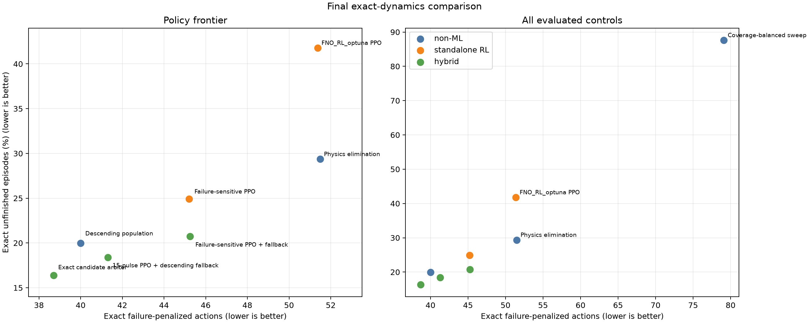

# `qlsgym`: ThF⁺ purification with exact dynamics, FNOs, and RL

This branch, `refiningFNO+RL`, studies finite-horizon purification of the
internal state of ThF⁺. It contains exact-table controls, FNO surrogates, PPO,
categorical SAC, Double DQN, and conservative hybrids.

**State of the branch (21 September 2026).** The best verified controller is
an exact one-step arbiter between a failure-sensitive PPO actor and a
descending-population rule. On the exact holdout it has **16.37% unfinished
episodes** and **38.70 failure-penalized actions**. The strongest standalone
actor has 24.92% and 45.20. The new column-v2 FNO passes every structural gate
for only 10 of 24 block/polarization pairs; it is therefore rejected for RL
training.



## 1. Mathematical object

Let

$$
I=\{1,\ldots,192\},\qquad
\mathcal S=\Delta^{191},\qquad
\mathcal A=\{1,\ldots,312\},\qquad
Y=\{0,1\}.
$$

An element $s\in\mathcal S$ is a molecular population vector. The action
set contains 288 Raman controls and 24 primitives. The outcomes $y=0,1$
denote the ground and excited motional readout branches.

For dynamics $D$, define the unnormalized branch map

$$
q_y^D:\mathcal S\times\mathcal A\longrightarrow\mathbb R_+^{I},
\qquad
\beta_y^D(s,a)=\mathbf 1^\top q_y^D(s,a),
\qquad
\Phi_y^D(s,a)=\frac{q_y^D(s,a)}{\beta_y^D(s,a)}.
$$

Thus $\beta_y^D$ is the Born probability and $\Phi_y^D$ is the posterior
belief, when $\beta_y^D>0$. The induced Markov kernel is

$$
P_D(s,a;B)=\sum_{y\in Y}\beta_y^D(s,a)
\mathbf 1_B\!\left(\Phi_y^D(s,a)\right),
\qquad
\sum_{y\in Y}\beta_y^D(s,a)=1.
$$

The exact engine $E$ evaluates this kernel from cached effective-Hamiltonian
action tables. A surrogate $\widehat E$ replaces in-window Raman maps by
learned maps; primitive and off-window actions use exact fallback dynamics.
The environment evolves populations, not coherences: after every measurement
and cooling step, the next state is again an element of $\mathcal S$.

For a policy $\pi$, let

$$
G=\{s\in\mathcal S:\|s\|_\infty\ge0.98\},\qquad
\tau_\pi=\inf\{t\ge0:s_t\in G\},\qquad H=80.
$$

The two reported functionals are

$$
F_D(\pi)=\Pr_D(\tau_\pi>H),
\qquad
C_D(\pi)=\mathbb E_D[\min(\tau_\pi,H)].
$$

`unfinished fraction` estimates $F_D$; `average actions` estimates $C_D$.
Controllers are ordered lexicographically by

$$
\mathcal R_D(\pi)=\bigl(F_D(\pi),C_D(\pi)\bigr).
$$

Hence reliability precedes speed. Every final claim uses $D=E$.

## 2. Physical and statistical contract

| Object | Value |
|---|---:|
| Molecular states | 192 in 12 Hamiltonian blocks |
| Motional truncation | 7 levels; Hilbert dimension $192\times7=1344$ |
| Initial distribution | thermal populations at 4 K |
| Raman time grid | 200 points, at most 6 ms |
| Action set | 312 controls |
| Success set | $\|s\|_\infty\ge0.98$ |
| Horizon | 80 actions |
| Learned/hybrid confirmation | 5 policy seeds × 5,000 exact episodes |

“Exact” means exact within this effective-Hamiltonian, seven-level,
population-reset model. It does not mean experimental certification.

Configuration selection and final evaluation use disjoint seeds. FNO scores
may select an FNO-trained policy, but they never establish the final ranking.
A controller is declared superior to a reference only when

$$
\sup \mathrm{CI}_{0.95}
\bigl(F_E(\pi)-F_E(\pi_0)\bigr)<0
\quad\text{and}\quad
C_E(\pi)-C_E(\pi_0)<0.
$$

The confidence interval is formed over the five paired policy seeds. Common
episode seeds are used within each comparison.

## 3. Final controller result

| Rank | Controller | Class | Exact failure ↓ | Exact actions ↓ | Inference |
|---:|---|---|---:|---:|---|
| 1 | **Exact candidate arbiter** | hybrid | **16.37%** | **38.70** | exact one-step scores |
| 2 | 15-pulse PPO + descending fallback | hybrid | 18.40% | 41.31 | actor prefix, then exact-table rule |
| 3 | Descending population | non-ML | 19.98% | 40.00 | exact-table rule |
| 4 | Failure-sensitive PPO + fallback | hybrid | 20.72% | 45.25 | actor, then physics rule |
| 5 | Failure-sensitive PPO | standalone RL | 24.92% | 45.20 | actor only |
| 6 | Physics elimination | non-ML | 29.36% | 51.49 | physics rule |
| 7 | Optuna PPO trained on downloaded FNO | standalone RL | 41.78% | 51.37 | actor only |
| 8 | Coverage-balanced sweep | non-ML | 87.60% | 79.11 | fixed schedule |

The descending-population policy maps the most populated state to the action
with maximum exact-table excited-branch yield. It is the strongest non-ML
reference found in this study.

For a belief $s$, let $a_L$ be the failure-sensitive PPO proposal and
$a_D$ the descending-population proposal. Define exact one-step scores

$$
S(s,a)=\sum_{y\in Y}\beta_y^E(s,a)
\mathbf 1_G\!\left(\Phi_y^E(s,a)\right),
\qquad
P(s,a)=\sum_{y\in Y}\beta_y^E(s,a)
\left\|\Phi_y^E(s,a)\right\|_\infty.
$$

The selected arbiter, with $\delta=10^{-4}$, is

$$
\pi_*(s)=
\begin{cases}
a_L,&S(s,a_L)>S(s,a_D),\\
a_L,&S(s,a_L)=S(s,a_D)\ \land\ P(s,a_L)>P(s,a_D)+\delta,\\
a_D,&\text{otherwise}.
\end{cases}
$$

Relative to descending population,

$$
F_E(\pi_*)-F_E(\pi_D)=-3.61\ \text{percentage points},
\qquad
\mathrm{CI}_{0.95}=[-4.75,-2.47],
$$

and $C_E(\pi_*)-C_E(\pi_D)=-1.30$. Among 25,000 paired episodes,
the arbiter rescues 1,478 baseline failures and loses 576 baseline successes.
This supports an empirical advantage for a model-based hybrid under the stated
contract. It does not show that a standalone RL policy is superior.

Detailed data and the comparison figure are in
[`results/thf_exact_candidate_arbiter`](results/thf_exact_candidate_arbiter)
and
[`results/thf_fno_rl_superiority`](results/thf_fno_rl_superiority).

## 4. FNO definition and acceptance criterion

For a block/polarization pair with $m$ molecular states, a structured
surrogate predicts the columns of

$$
K(a)=
\begin{pmatrix}K_0(a)\\K_1(a)\end{pmatrix}
\in\mathbb R_+^{2m\times m},
\qquad
q_y(s,a)=K_y(a)s.
$$

Column-v2 enforces

$$
K(a)\ge0,
\qquad
\mathbf 1^\top K(a)=\mathbf 1^\top,
\qquad
K(\omega,0)=
\begin{pmatrix}I_m\\0\end{pmatrix}.
$$

Consequently probability conservation, input linearity, and zero-time identity
hold by construction. Let

$$
d_{\mathrm{TV}}(u,v)=\tfrac12\|u-v\|_1.
$$

A manifest is admissible only if every one of the 24 pairs passes every row of
the following audit. The table reports the worst pairwise value.

| Gate | Bound | Downloaded `mix` | Column-v2 | Column-v2 status |
|---|---:|---:|---:|:---:|
| zero-time identity TV, max | $10^{-3}$ | 0.11097 | **0** | pass |
| input-linearity TV, P95 | $10^{-3}$ | 0.07656 | **$8.44\times10^{-17}$** | pass |
| off-resonance joint TV, P95 | 0.005 | 0.06716 | **0.000945** | pass |
| branch-mass absolute error, P95 | 0.005 | **0.01659** | 0.07254 | fail |
| conditional TV, mass $\ge10^{-2}$, P95 | 0.05 | **0.12558** | 0.27775 | fail |
| conditional TV, mass $\ge10^{-3}$, P95 | 0.10 | **0.21491** | 0.68902 | fail |
| block-local termination error | 0.005 | **0.04838** | 0.10705 | fail |
| pairs passing all gates | 24 required | 0/24 | **10/24** | fail |

Column-v2 removes the elementary structural defects but worsens the quantities
that determine measurement branches. Its worst failures occur at block 11,
polarization `+`.

The closed-loop diagnostic makes the rejection decisive:

| Controller | Exact | Downloaded `mix` | Column-v2 |
|---|---:|---:|---:|
| Failure-sensitive PPO | 24.92% / 45.20 | 28.98% / 48.40 | **89.51% / 73.62** |
| Descending population | 19.98% / 40.00 | 23.68% / 41.44 | **91.10% / 73.40** |

Each entry is failure/actions. Since column-v2 violates the all-pair gate and
changes closed-loop failure by about 70 percentage points, no policy is trained
under it. The next surrogate experiment must first reduce branch-mass,
conditional-state, and termination errors on policy-occupancy data.

See the
[`full structural audit`](results/thf_column_fno_v2_full_audit/summary.md) and
[`closed-loop audit`](results/thf_column_fno_v2_transfer/summary.md).

## 5. Retained evidence from earlier runs

The following results explain the choices retained in this branch. They are
not separate claims.

| Lineage | Training dynamics | Controller | Exact failure | Exact actions | Retained conclusion |
|---|---|---|---:|---:|---|
| `FNO_RL_agents` | downloaded `mix` | locked PPO | 73.89% | 68.15 | the downloaded model alone did not recover RL |
| `FNO_RL_optuna` | downloaded `mix` | Optuna PPO | 41.78% | 51.37 | PPO is sensitive to learning rate and update geometry |
| `FNO_RL_optuna` | downloaded `mix` | focused SAC | 57.07% | 59.85 | entropy/reward co-tuning helps, but seed variance remains large |
| `refiningFNO+RL` | `mix`, then exact | PPO fine-tune | 33.44% | 48.21 | exact fine-tuning corrects part of the surrogate bias |
| `refiningFNO+RL` | exact | failure-sensitive PPO | 24.92% | 45.20 | a terminal penalty aligns training with failure-first evaluation |

The retained PPO initialization is `ppo_t71`: one 512-unit hidden layer,
learning rate $1.346\times10^{-3}$, clip 0.1, eight epochs, 16 minibatches,
$\gamma=1$, $\lambda_{\mathrm{GAE}}=0.98$, square-root beliefs, and qMDP
value targets. Failure-sensitive continuation adds the terminal reward

$$
r_t=-1-20\,\mathbf 1\{t=H\text{ and }s_t\notin G\}.
$$

The detailed Optuna records remain in
[`results/thf_rl_optuna_mix`](results/thf_rl_optuna_mix) and
[`results/thf_rl_optuna_mix_sac_refine`](results/thf_rl_optuna_mix_sac_refine).
The experimental rationale is archived in
[`docs/FNO_RL_IMPROVEMENT_PLAN.md`](docs/FNO_RL_IMPROVEMENT_PLAN.md) and
[`docs/FNO_RL_SUPERIORITY_PLAN.md`](docs/FNO_RL_SUPERIORITY_PLAN.md).

## 6. Repository map

| Path | Role |
|---|---|
| `src/qlsgym/env` | belief MDP, action library, cached transition tables |
| `src/qlsgym/physics` | effective-Hamiltonian propagation |
| `src/qlsgym/surrogate` | FNOs, manifests, datasets, metrics |
| `src/qlsgym/rl` | PPO, categorical SAC, Double DQN |
| `src/qlsgym/policies` | non-ML and hybrid policies |
| `scripts` | training, audits, evaluation, aggregation |
| `results/thf_fno_rl_superiority` | final ranking and figure |
| `results/thf_exact_candidate_arbiter` | selected arbiter and paired statistics |
| `results/thf_column_fno_v2_full_audit` | 24-pair FNO audit |
| `results/thf_column_fno_v2_transfer` | closed-loop FNO diagnostic |

Large checkpoints are external to Git. The downloaded
`munozariasjm/thf_qls_fno` checkpoints must be installed as
`$QLSGYM_WORK/checkpoints/thf/mix.json`; the manifest contains 24 entries and
uses molecule fingerprint `d7deb43457d3`.

## 7. Installation and use

Python 3.11 or later and PyTorch 2.3 or later are required.

```bash
python -m pip install -e '.[gym,fno,analysis,test,tune]'
export QLSGYM_WORK=/path/to/qlsgym_work
export PYTHONPATH="$PWD/src"
python -m pytest -q -m 'not slow'
```

Load the downloaded surrogate:

```python
from qlsgym import load_molecule
from qlsgym.surrogate.manifest import load_manifest

mol = load_molecule("thf")
engine = load_manifest(mol, "mix")
```

Regenerate the final compact report from committed results:

```bash
python scripts/summarize_thf_fno_rl_superiority.py \
  --results results --output results/thf_fno_rl_superiority
```

The principal full-study commands are:

```bash
# Strong non-ML controls.
python scripts/evaluate_thf_nonml_controls.py

# Exact continuation of the retained PPO and conservative hybrids.
GPU0=0 GPU1=2 bash scripts/run_thf_safe_hybrid.sh
GPU0=0 GPU1=2 bash scripts/run_thf_descending_hybrid.sh
GPU0=0 GPU1=2 bash scripts/run_thf_exact_arbiter.sh

# Structured FNO pilot. Continue to the full run only if its gate passes.
GPU0=0 GPU1=2 bash scripts/run_thf_column_fno_v2_pilot.sh

# Full training, all-pair audit, and diagnostic transfer.
GPU0=0 GPU1=2 bash scripts/run_thf_column_fno_v2_full.sh
GPU0=0 GPU1=2 bash scripts/run_thf_column_v2_transfer.sh
```

The scripts persist per-candidate and per-seed records. GPU jobs use physical
devices 0 and 2 with at most one process on each device. A failed FNO gate is
a stopping condition: downstream RL training must not be started from that
manifest.
