# ThF⁺ quantum-logic spectroscopy: FNO surrogates and RL

This branch studies **ThF⁺ state purification** using a Fourier neural operator (FNO) transition surrogate and PPO, categorical SAC and Double DQN. It adapts accuracy, timing and finished-episode metrics from [arXiv:2608.03702](https://arxiv.org/pdf/2608.03702), not that paper's molecule or hardware.

## Temporal FNO result — completed 1 October 2026

Branch `seqFNO_RL` tests attention over the 200-point physical pulse-time grid.
It keeps the state-to-branch map linear, enforces stochastic transfer columns
and exact zero-time identity, and trains only against exact transfer columns.
The sequence variable is intra-pulse time `tau`; it is not RL decision history.

The six-pair hard pilot trained 48 models across the architecture, loss,
shuffled-time, pure-Transformer, and matched-budget comparisons. It used Tara
GPUs 0 and 2 for an estimated 1.97 GPU-hours.

| model | pairs passing every gate | worst branch-mass P95 | worst conditional TV P95 | on-resonance spectral error |
|---|---:|---:|---:|---:|
| downloaded `mix` | 0/6 | **0.01659** | **0.12558** | 0.000199 |
| structured `column_v2` | 2/6 | 0.07254 | 0.27775 | 0.000259 |
| temporal FNO, matched budget | **4/6** | 0.07532 | 0.32937 | **0.000172** |

Attention improves blocks 0 and 1, but block 9/+ still fails the termination
gate and block 11/+ still fails branch-mass and conditional-posterior gates.
The six-pair promotion rule therefore failed. Full 24-pair training and new
PPO/SAC training were stopped; the valid RL comparison remains the optimized
downloaded-`mix` result below. This prevents a failed surrogate from producing
an uninterpretable policy score.

See the [complete temporal-FNO protocol and interpretation](docs/THF_TEMPORAL_FNO_STUDY.md),
the [machine-readable final summary](results/thf_temporal_fno_study/summary.json),
and the [controlled-ablation summary](results/thf_temporal_fno_refinement/comparison/summary.md).

Optimization branch **FNO_RL_optuna** extends native qlsgym branch **FNO_RL_agents**, based on main commit 2a7ee186f09c54b78d5987bcd0a6bb2399749e28. Experiment code and historical FNO results were selectively transferred from [the earlier RL branch](https://github.com/HHTseng/rl_qls_paper_replication/tree/FNO_RL_agents), commit d306d34; unrelated experiments were not merged. The underlying library remains intact.

## Optuna optimization — completed 19 September 2026

With the downloaded `mix` FNO fixed, two Tara H100 GPUs completed 240 broad
Optuna trials, 18 one-million-transition promotion runs, and 15 final runs
(three agents × five training seeds). Broad search and promotion used only FNO
validation; exact dynamics were reserved as an audit. Each final seed used
5,000 FNO and 5,000 exact holdout episodes.

| Agent | Exact failure baseline | Optimized | Difference | Exact actions baseline | Optimized | Difference |
|---|---:|---:|---:|---:|---:|---:|
| PPO | 73.89% | **41.78%** | **32.11 pp lower** | 68.15 | **51.37** | **16.77 lower** |
| SAC | **69.41%** | 80.68% | 11.27 pp higher | **66.07** | 71.88 | 5.80 higher |
| DDQN | 98.56% | **94.61%** | **3.95 pp lower** | 78.88 | **76.00** | **2.88 lower** |

- **PPO is highly tunable:** exact success rises from 26.11% to 58.22%, with
  5.72-percentage-point standard deviation across training seeds. The chosen
  shallow 512-unit network uses `lr=1.35e-3`, `clip=0.1`, eight epochs, 16
  minibatches, undiscounted one-step QMDP values, and low entropy regularization.
- **Optimization does not close the control gap.** Physics elimination still has
  29.36% exact failure, 12.42 points below optimized PPO. Its 51.49 average
  actions are close to PPO's 51.37 because PPO succeeds less often but uses only
  30.91 actions on its successful episodes.
- **SAC did not improve under this selection protocol.** The promoted setting
  reduced the learning rate to `3.70e-5`, disabled temperature tuning, and
  performed worse than the locked SAC configuration at one million transitions.
  Short-budget FNO ranking is therefore not a reliable guarantee of long-budget
  improvement for SAC.
- **DDQN improves modestly but remains ineffective:** exact success is 5.39%
  and varies substantially with training seed.
- PED-ANOVA attributes 59.6% of PPO's broad-trial variation to learning rate,
  followed by entropy coefficient (12.3%). SAC is controlled mainly by initial
  temperature (26.9%), target-update rate (26.2%), and learning rate (20.8%);
  DDQN is controlled mainly by network depth (35.9%) and target-update rate
  (22.4%). These are search-local associations, not causal effects.
- Optimized PPO's exact-minus-FNO failure gap is 2.88 points, but the fixed FNO
  still gives the physics policy a 33.78-point gap. Hyperparameter search can
  find a controller that tolerates the surrogate; it does not validate or fix
  the surrogate's closed-loop dynamics.

See the [optimization report](results/thf_rl_optuna_mix/summary.md),
[`summary.json`](results/thf_rl_optuna_mix/summary.json), and
[`selected_configs.json`](results/thf_rl_optuna_mix/selected_configs.json). The
complete 240-trial export is in
[`broad_trials.json`](results/thf_rl_optuna_mix/broad_trials.json).

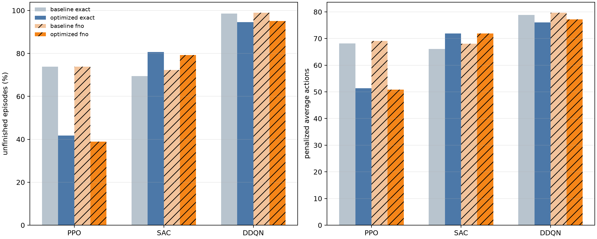

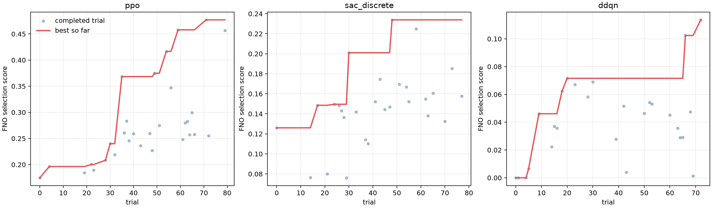

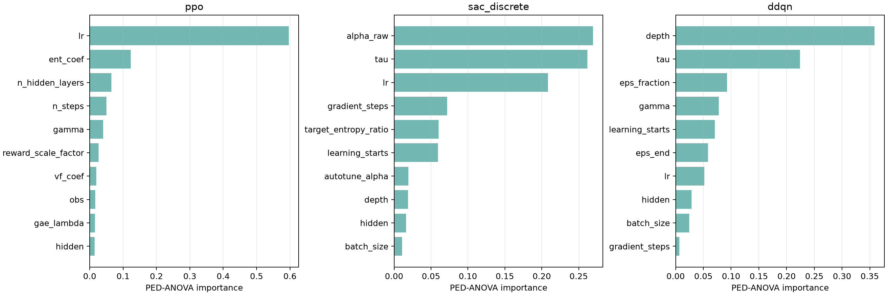

## Focused SAC refinement from the earlier RL repository

The strong discrete-SAC result in
[`rl_qls_paper_replication_FNO_RL_agents`](https://github.com/HHTseng/rl_qls_paper_replication/tree/FNO_RL_agents)
is useful optimizer evidence, but it is not a direct ThF+ FNO result. Its selected
H3O+ configuration came from a 12-trial validation screen using exact action
tables, 130 states, 218 actions, $H=400$, purity 0.99, and the sampled S17 target.
This repository uses the downloaded ThF+ `mix` FNO, 192 states, 312 actions,
$H=80$, purity 0.98, and the S18 expectation over both measurement branches.

The comparison identified four settings omitted or underrepresented in the
first ThF+ SAC search:

- H3O+ used 16 environments and two gradient steps per collection step, or
  $2/16=0.125$ updates per transition. The previous selected ThF+ trial used
  $4/(2\times128)=0.015625$, eight times fewer updates per transition.
- H3O+ used raw belief $p$; ThF+ SAC fixed the input to $\sqrt p$.
- H3O+ selected automatic temperature tuning with target entropy
  $0.215\log|\mathcal A|$; the previous ThF+ winner disabled tuning at 0.771.
- H3O+ selected reward divisor $R=5$ and initial $\alpha=0.027$. The focused
  search varies $R$ and the dimensionless ratio $\widetilde\alpha=\alpha R$ so
  reward and entropy scales remain interpretable together.

`scripts/refine_thf_mix_sac.py` therefore searches `n_envs`, updates per
transition, raw versus square-root beliefs, reward/temperature scale, entropy
target, replay warmup and capacity, learning rate, discount, target-update rate,
batch size, width, and depth. It keeps the FNO manifest, action library,
environment, and S18 target fixed. Each broad trial trains paired seeds at
300,000 transitions; four candidates are promoted at one million transitions,
and the winner is confirmed with five fresh seeds. Exact dynamics remain an
audit and never select a configuration.

Run the resumable two-GPU pipeline on Tara with GPUs 0 and 2:

    tmux new-session -d -s thf_mix_sac_refine \
      'cd ~/qlsgym_FNO_RL_optuna && bash scripts/run_thf_mix_sac_refine.sh'

Monitor it with:

    source /usr/local/anaconda3/etc/profile.d/conda.sh
    conda activate qlsgym
    python scripts/refine_thf_mix_sac.py status \
      --output results/thf_rl_optuna_mix_sac_refine

### Focused SAC result — completed 21 September 2026

The focused run completed 25 paired-seed broad trials, eight promotion runs
(four candidates × two fresh seeds), and five final one-million-transition
training seeds. Every final policy was evaluated on 5,000 FNO and 5,000 exact
episodes. Selection used FNO validation only; the exact simulator remained an
audit.

| SAC run | Exact failure ↓ | Exact actions ↓ | FNO failure ↓ | FNO actions ↓ |
|---|---:|---:|---:|---:|
| Locked baseline | 69.41% | 66.07 | 72.23% | 68.03 |
| Previous general Optuna search | 80.68% | 71.88 | 79.31% | 71.88 |
| **Focused refinement** | **57.07%** | **59.85** | **56.59%** | **59.49** |

The refined SAC lowers exact failure by **12.34 percentage points** and exact
average actions by **6.22** relative to the locked SAC baseline. FNO failure
falls by **15.64 points** and FNO actions by **8.53**. The exact-minus-FNO gaps
are only +0.48 failure points and +0.36 actions for these policies, so transfer
is good on their visited distribution.

The selected `sac_t24` configuration uses 16 environments, one gradient update
per collection step (1/16 update per transition), $\sqrt p$ observations,
`lr=1.5048e-4`, $\gamma=0.995$, $\tau=0.00305$, batch 512, replay capacity
100,000, warmup 1,000, a single 128-unit hidden layer, reward divisor $R=20$,
and automatic temperature tuning toward
$0.4997\log|\mathcal A|$. Its initial dimensionless entropy/reward ratio is
$\widetilde\alpha=\alpha R=0.2654$.

Across the focused search, PED-ANOVA assigns 42.3% of local variation to target
entropy, 35.3% to the temperature/reward ratio, 4.7% to learning rate, and 3.8%
to update ratio. The main transferable lesson is that SAC needed joint tuning
of reward scale and entropy scale, paired-seed screening, and substantially
fewer parallel environments than the first ThF+ search. These importances are
search-local associations.

Seed sensitivity remains material: exact failure has 18.96-percentage-point
standard deviation across five training seeds and FNO failure has 16.68 points.
The refined mean also remains behind optimized PPO (41.78% exact failure) and
physics elimination (29.36%). This is a real SAC improvement under the fixed
downloaded FNO, but it does not establish that the FNO is accurate on all
closed-loop state distributions.

See the [focused refinement report](results/thf_rl_optuna_mix_sac_refine/summary.md),
[summary JSON](results/thf_rl_optuna_mix_sac_refine/summary.json), and
[selected configuration](results/thf_rl_optuna_mix_sac_refine/selected_config.json).

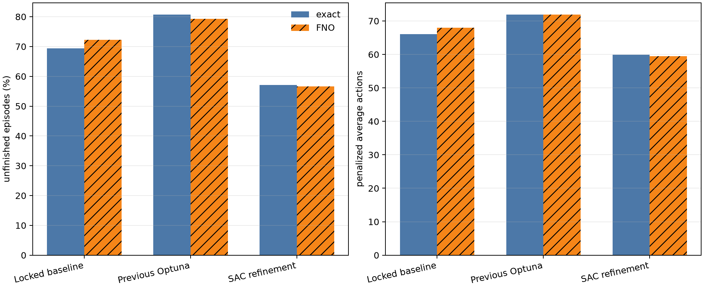

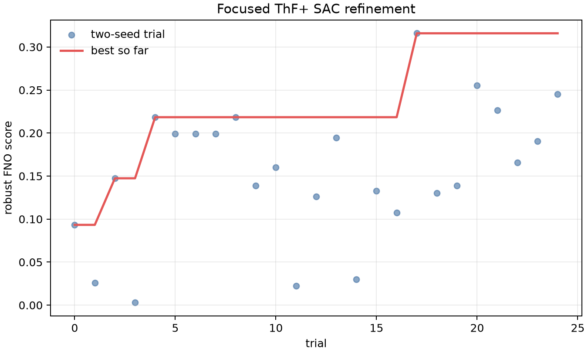

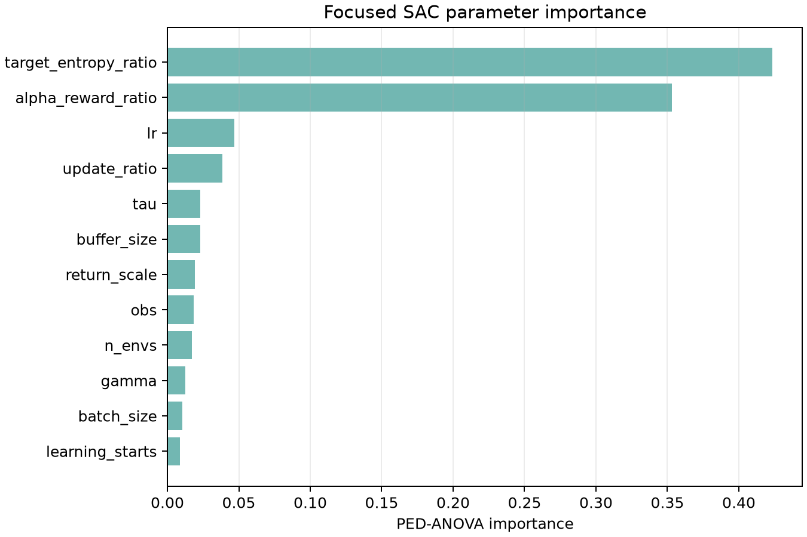

## Current conclusions — downloaded `mix` rerun completed 18 September 2026

The downloaded `munozariasjm/thf_qls_fno` manifest has **24/24 block/polarization checkpoints** (fingerprint `d7deb43457d3`). On Tara, PPO, SAC and DDQN were each rerun with five training seeds at approximately one million transitions per seed. All 18 controllers have 5000 exact and 5000 FNO evaluation episodes under the same locked contract as the original `rlprod120v2` study.

- **Physics elimination remains strongest:** exact failure is 29.36% and average actions are 51.49. The exact baseline values reproduce the original run because the policy and evaluation seed are unchanged.
- **The downloaded model gives a small learned-policy improvement, not a qualitative recovery.** SAC reaches 69.41% exact failure and 66.07 actions; PPO reaches 73.89% and 68.15. Relative to the original FNO, failure improves by 2.28 percentage points for SAC and 2.86 points for PPO, but neither approaches physics elimination.
- **DDQN remains ineffective:** exact failure is 98.56% (78.88 actions), versus 100% with the original FNO. A few successful episodes do not establish a useful greedy policy.
- **The FNO is still not closed-loop certified.** Physics elimination fails 63.14% under `mix` but 29.36% exactly, a 33.78-point pessimistic gap. That is better than the original model's 42.40-point gap but remains large enough to distort long-horizon control.
- **Transfer agreement depends on the visited state distribution.** PPO's aggregate exact-minus-FNO failure gap is only +0.05 points and SAC's is -2.82 points, even though the physics heuristic exposes much larger model bias. Learned-policy agreement alone therefore cannot validate the surrogate over the relevant state space.

See the [downloaded-model summary](results/thf_rl_mix_tara/summary.md), [generation comparison](results/thf_rl_mix_tara/generation_comparison.md), [detailed original analysis](docs/THF_FINAL_ANALYSIS.md), and exact ranking below. Lower failure and failure-penalized average actions are better.

## Physics and environment

| Quantity | ThF⁺ experiment |
|---|---|
| Molecular belief | $s\in\Delta^{191}$: 192 states, 12 Hamiltonian blocks |
| Motional truncation | 7 levels; Hilbert dimension $192\times7=1344$ |
| Measured outcomes | $k=0$: ground; $k=1$: all excited motional levels |
| Initialization | Thermal populations, 4 K |
| Controls | 312 actions: 288 Raman $(\sigma,\omega,\tau)$ + 24 primitives |
| Pulse duration | 200-time FNO grid, maximum 6 ms |
| Episode | $\max_i s_i\ge0.98$ target; $H=80$ actions; $\rho=0$ |
| Dynamics | FNO Raman propagation; primitives exact; final ranking evaluated exactly |

The environment carries **populations, not coherences**: each pulse starts from a diagonal molecular mixture with the motion in its ground state. Posterior populations after readout/cooling define the next input. “Exact” below means exact within this effective-Hamiltonian, seven-level, population-reset model, not experimental certification.

For action $a$, define unnormalized branch population $u_k(s,a)\ge0$, Born probability $\pi_k=\sum_i u_{k,i}$ and conditional belief $s'_k=u_k/\pi_k$. The quantum belief MDP has

$$P(s'|s,a)=\sum_{k=0}^1\pi_k(s,a)\delta(s'-s'_k),\qquad \sum_k\pi_k=1.$$

For a block with $m_f$ states, FNO maps $(s_f,\omega,\sigma)$ to joint populations in $\Delta^{2m_f-1}$ at all pulse times. Two readout groups do **not** mean a two-level motional Hamiltonian. Effective Hamiltonian construction: [heff](https://github.com/arianjad/heff/tree/main).

### Sampled versus branch-expected updates

Let $c_k=1$ only when branch $k$ is nonterminal and budget remains. Write $Q(s,a)$ for action value, $V(s)$ for the appropriate next-state value (maximum-Q for Q-learning), $r_k$ for branch reward, $\gamma$ for discount and $\eta$ for learning rate. The [earlier RL paper](https://arxiv.org/pdf/2410.11839) motivates these S17-style sampled and S18-style branch-expected targets, with terminal/budget masks:

$$\text{S17:}\quad y=r_K+\gamma c_KV(s'_K),\quad K\sim\{\pi_k\};\qquad Q\leftarrow Q+\eta(y-Q),$$

$$\text{S18:}\quad y=\sum_{k=0}^1\pi_k[r_k+\gamma c_kV(s'_k)];\qquad Q\leftarrow Q+\eta(y-Q).$$

They represent the same expected physical Bellman operator with correct branches. Branch expectation reduces measurement-sampling variance; it does **not** fix FNO bias. DDQN uses online-action selection/target-Q evaluation, SAC a soft value, and PPO a branch-expected critic residual inside sampled-trajectory GAE. [Full protocol](docs/THF_FINAL_RL_STUDY.md).

## Install and reproduce

Python≥3.11, PyTorch≥2.3. The original production runs used `/home/htseng/anaconda3/envs/qlsgym` on wcs164084; the downloaded-`mix` rerun used `/home/htseng/.conda/envs/qlsgym` on Tara.

    python -m pip install -e '.[gym,fno,analysis,test,tune]'
    export QLSGYM_WORK=/path/to/qlsgym_work
    export PYTHONPATH="$PWD/src"
    python -m pytest -q -m 'not slow'

Run one locked downloaded-`mix` job, or use `scripts/run_thf_mix_tara_study.sh` to reproduce the Tara queue:

    python scripts/thf_rl_agents.py run --agent ppo --preset final \
      --manifest "$QLSGYM_WORK/checkpoints/thf/mix.json" --fno-tag mix \
      --min-manifest-coverage 1.0 --seed 0 --device cuda:0 \
      --eval-batch 128 --output results/thf_rl_mix_tara

### Two-GPU Optuna optimization with the downloaded FNO fixed

`scripts/run_thf_mix_optuna.sh` runs the complete optimization and confirmation
pipeline on two GPUs (Tara GPUs 0 and 2 by default):

    cd ~/qlsgym_FNO_RL_optuna
    export QLSGYM_WORK=$HOME/qlsgym_work
    GPUS="0 2" TRIALS_PER_WORKER=40 \
      scripts/run_thf_mix_optuna.sh

The two workers jointly run 80 broad trials for each of PPO, categorical SAC,
and DDQN. Each trial has at most 250,000 FNO transitions, and successive-halving
pruning can stop it after any of four validation rungs. Training length is a
fidelity budget rather than a free parameter: otherwise Optuna can prefer short,
cheap trials even though the scientific comparison requires equal training.
The search covers learning rate, hidden width/depth, PPO rollout and update
geometry, discount/GAE/value target, entropy and clipping, SAC temperature and
target entropy, DDQN exploration, replay batch size, target-update rate, and
gradient-to-environment update ratio.

Broad search and promotion select configurations only from fixed-seed FNO
validation using

$$J=p_{\mathrm{success}}+0.02\left(1-\frac{\bar A}{H}\right),\qquad H=80,$$

so success dominates and failure-penalized action count $\bar A$ breaks close
ties. The top three configurations per agent are retrained for one million
transitions with seeds 100 and 101. The winner is retrained with seeds 0--4 and
evaluated on 5,000 FNO plus 5,000 exact episodes per seed using holdout seed
20001. The exact results are therefore an audit of transfer and do not influence
selection. Outputs, Optuna storage, logs, selected configurations, models, and
figures are written to `results/thf_rl_optuna_mix`. Monitor a running study with:

    python scripts/optimize_thf_mix_rl.py status \
      --output results/thf_rl_optuna_mix

Exact environment:

    import torch
    from qlsgym import load_molecule
    from qlsgym.env.actions import ActionLibrary
    from qlsgym.env.cache import build_action_tables
    from qlsgym.env.env import EnvConfig, PurificationEnv

    mol = load_molecule("thf")
    library = ActionLibrary.physics_subset(mol)
    tables = build_action_tables(mol, library, device="cpu")
    env = PurificationEnv(mol, library, tables,
                          EnvConfig(p_target=0.98, max_pulses=80), batch=64)
    state = env.reset(seed=0)
    transition = env.step(torch.randint(library.n_actions, (64,)))

Train one long FNO pair and independently test it:

    python scripts/prepare_thf_fno.py train-block --work "$QLSGYM_WORK" \
      --preset long --tag rlprod120v2 --block 0 --sigma + --device cuda:0 --storage-device cpu
    python scripts/prepare_thf_fno.py evaluate-block --work "$QLSGYM_WORK" \
      --tag rlprod120v2 --block 0 --sigma + --device cuda:0

Repeat for all 12 blocks and both polarizations, then assemble the full manifest:

    python scripts/prepare_thf_fno.py manifest --work "$QLSGYM_WORK" \
      --tag rlprod120v2 --sigmas both --device cpu

Paper-style tests and the original **full** RL grid were coordinated by scripts/run_thf_final_study.sh in tmux and completed on 17 September 2026. The downloaded-`mix` rerun used `scripts/run_thf_mix_tara_study.sh` on Tara GPUs 0, 2 and 3; GPU 1 was unavailable to PyTorch. It writes a distinct generation under `results/thf_rl_mix_tara`, validates all 18 records before aggregation, and leaves the original locked results intact. [Execution details](docs/THF_FINAL_RL_STUDY.md).

<!-- FNO_RESULTS_START -->
## Original locally trained production FNO accuracy

Completed checkpoints with independent held-out tests: **24/24**. All completed models trained for 120 epochs; checkpoints are preselected `best_onres.pt`, never test-selected.

| Block | σ | On-resonance median infidelity, diffuse ↓ | On-resonance median, control mixture ↓ | Control-mixture P95 ↓ | Static/no-change median |
|---:|:---:|---:|---:|---:|---:|
| 0 | + | 0.00622 | 0.02051 | 0.02180 | 0.17603 |
| 1 | + | 0.00594 | 0.02051 | 0.02131 | 0.19463 |
| 2 | + | 0.00424 | 0.01245 | 0.01309 | 0.14371 |
| 3 | + | 0.00388 | 0.01345 | 0.01431 | 0.15958 |
| 4 | + | 0.00207 | 0.00613 | 0.00646 | 0.10285 |
| 5 | + | 0.00205 | 0.00647 | 0.00685 | 0.11909 |
| 6 | + | 0.00117 | 0.00360 | 0.00411 | 0.06656 |
| 7 | + | 0.00111 | 0.00346 | 0.00382 | 0.06888 |
| 8 | + | 0.00049 | 0.00145 | 0.00171 | 0.04142 |
| 9 | + | 0.00045 | 0.00150 | 0.00169 | 0.04153 |
| 10 | + | 0.00020 | 0.00040 | 0.00046 | 0.06502 |
| 11 | + | 0.04455 | 0.05790 | 0.07685 | 0.06502 |
| 0 | - | 0.00578 | 0.01864 | 0.01937 | 0.15703 |
| 1 | - | 0.00817 | 0.02600 | 0.02715 | 0.17144 |
| 2 | - | 0.00368 | 0.01141 | 0.01224 | 0.12984 |
| 3 | - | 0.00429 | 0.01362 | 0.01443 | 0.14811 |
| 4 | - | 0.00202 | 0.00648 | 0.00691 | 0.09330 |
| 5 | - | 0.00174 | 0.00595 | 0.00630 | 0.10941 |
| 6 | - | 0.00113 | 0.00316 | 0.00358 | 0.05713 |
| 7 | - | 0.00104 | 0.00322 | 0.00368 | 0.05737 |
| 8 | - | 0.00044 | 0.00131 | 0.00167 | 0.04071 |
| 9 | - | 0.00046 | 0.00129 | 0.00160 | 0.04093 |
| 10 | - | 0.00014 | 0.00036 | 0.00126 | 0.05233 |
| 11 | - | 0.00016 | 0.00034 | 0.00038 | 0.05233 |

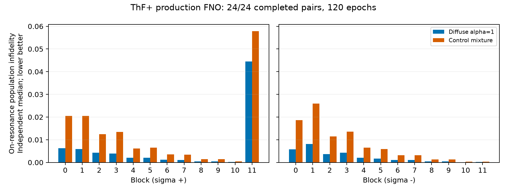

Each row uses 32 new frequencies per stratum × 128 initial states, seeds 20260916/17, with 200 single-pulse time samples. Values average over initial states and pulse times before computing frequency percentiles. Diffuse and peaked input ensembles are not interchangeable.

Accuracy on resonance improved strongly over the 30-epoch pilot, but a few-percent error floor remains on peaked beliefs. Off-resonance static predictions can outperform FNO; small unconditional error does not guarantee accurate normalized measurement branches or closed-loop purification.

### Preliminary CPU audit: block 0, σ=+

32 new frequencies/stratum × 128 initial states; device `cpu`. Reference: exact PyTorch, not CUDA-Q.

- Representative resonant trajectory: time-average population infidelity 0.0073515.
- Zero-time identity total-variation error: 0.052159 (ideal 0).
- Near-pure input mean/P95 infidelity: 0.0041929/0.005594.
- Near-pure conditional-branch P95 TV: 0.21304, excluding exact branch masses <10⁻³.
- Input-mixture linearity TV: 0.04103 (ideal 0).

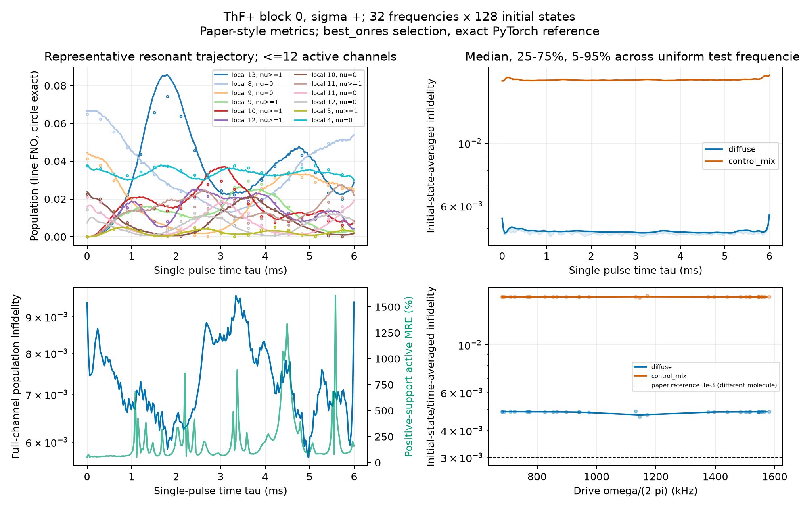

Exact-build/FNO speedup range: 0.32–11.15×; cached-exact/FNO: 0.00153–0.0171×. These compare different amortization regimes, not the paper's CUDA-Q benchmark.

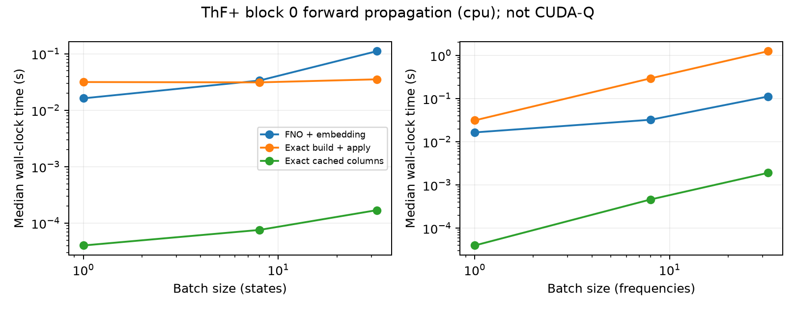

### Full paper-style audit: block 1, σ=-

100 new frequencies/stratum × 500 initial states; device `cuda:1`. Reference: exact PyTorch, not CUDA-Q.

- Representative resonant trajectory: time-average population infidelity 0.016159.
- Zero-time identity total-variation error: 0.067162 (ideal 0).
- Near-pure input mean/P95 infidelity: 0.004456/0.0065554.
- Near-pure conditional-branch P95 TV: 0.50592, excluding exact branch masses <10⁻³.
- Input-mixture linearity TV: 0.027968 (ideal 0).

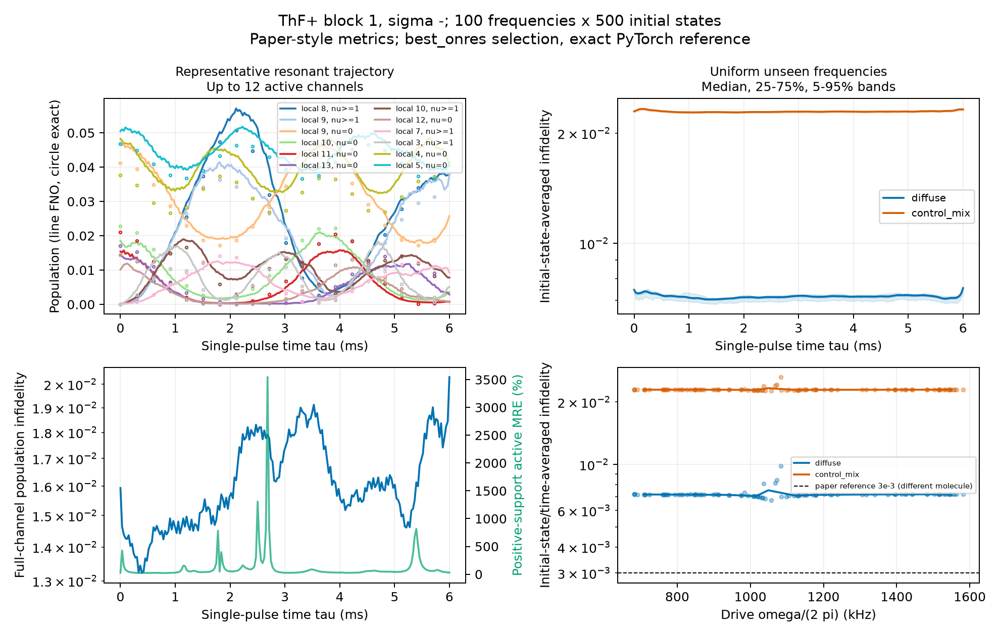

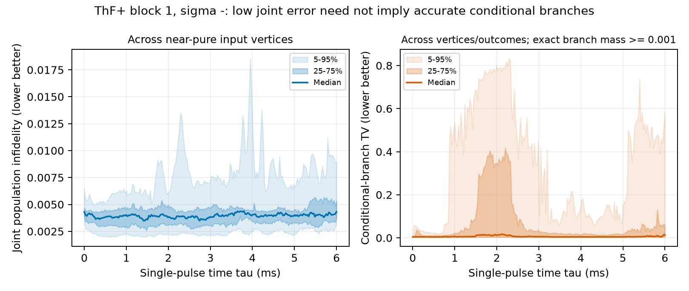

Exact-build/FNO speedup range: 0.91–103.15×; cached-exact/FNO: 0.0145–0.141×. These compare different amortization regimes, not the paper's CUDA-Q benchmark.

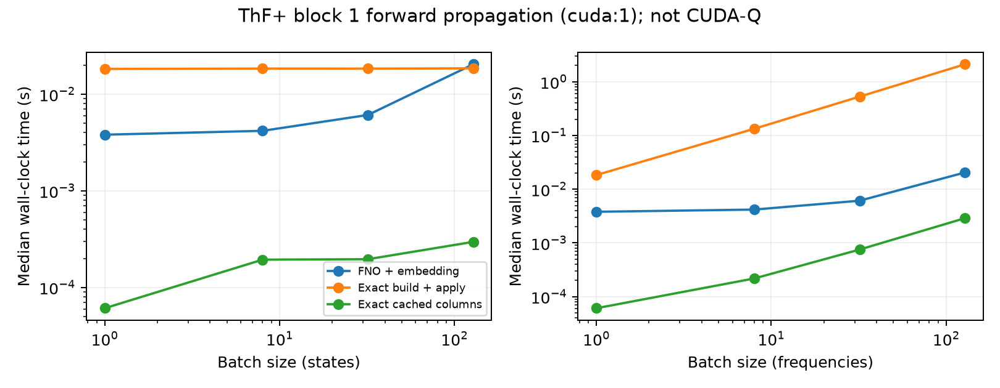

### Full paper-style audit: block 0, σ=+

100 new frequencies/stratum × 500 initial states; device `cuda:0`. Reference: exact PyTorch, not CUDA-Q.

- Representative resonant trajectory: time-average population infidelity 0.0073515.
- Zero-time identity total-variation error: 0.052159 (ideal 0).
- Near-pure input mean/P95 infidelity: 0.0041929/0.005594.
- Near-pure conditional-branch P95 TV: 0.21304, excluding exact branch masses <10⁻³.
- Input-mixture linearity TV: 0.04103 (ideal 0).

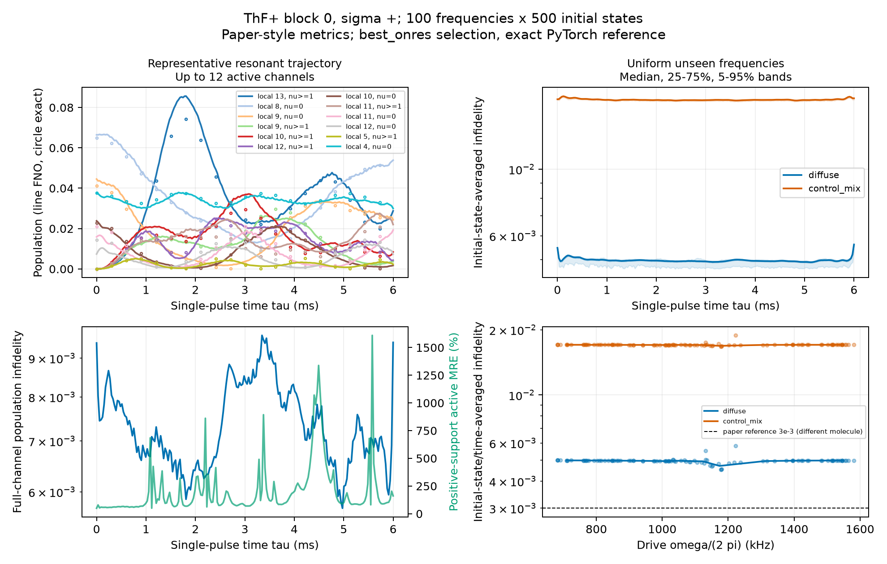

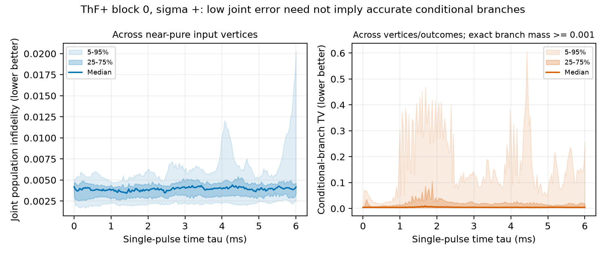

Exact-build/FNO speedup range: 0.79–85.98×; cached-exact/FNO: 0.0124–0.116×. These compare different amortization regimes, not the paper's CUDA-Q benchmark.

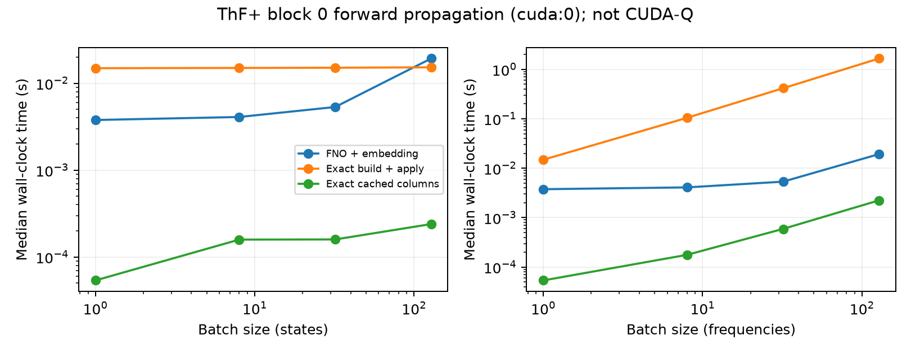

The CPU preview finds 5.2% zero-time identity TV, 4.1% input-linearity TV, and conditional-branch P95 TV ≈21% despite near-pure mean joint infidelity ≈0.0042. Large MRE spikes are driven by small positive true populations; infidelity and absolute/TV diagnostics give complementary context. Low joint error is not a closed-loop certification.

For fixed-frequency state batches, exact propagation amortizes one eigendecomposition over many input states. Fresh frequency batches reach up to 11.2× FNO speedup, but cached exact is 58–655× faster across tested workloads. These CPU timings do not predict GPU timings; full audits log those separately. A compact fixed312-action problem can favor exact tables; FNO's stronger motivation is larger or changing/continuous control sets.
<!-- FNO_RESULTS_END -->

<!-- FINAL_RL_RESULTS_START -->
## External `mix` FNO exact-simulator ranking

Complete locked grid: 15 learned policies and three baselines. Each policy has 5000 exact and 5000 surrogate rollouts.

| Controller | Training seeds | Exact average actions ↓ (95% CI) | Exact failure ↓ (95% CI) | FNO average actions | FNO failure |
|---|---:|---:|---:|---:|---:|
| Physics elimination | 0 | 51.49 [50.78, 52.22] | 29.36% [28.11, 30.64] | 64.52 | 63.14% |
| Discrete SAC | 5 | 66.07 [62.67, 70.87] | 69.41% [63.28, 77.18] | 68.03 | 72.23% |
| PPO | 5 | 68.15 [67.39, 68.91] | 73.89% [72.12, 75.67] | 69.14 | 73.84% |
| Random | 0 | 74.57 [74.11, 75.01] | 85.62% [84.62, 86.57] | 75.91 | 86.20% |
| Double DQN | 5 | 78.88 [78.03, 79.58] | 98.56% [97.48, 99.46] | 79.69 | 98.97% |
| Sweeping | 0 | 79.97 [79.94, 80.00] | 99.92% [99.79, 99.97] | 79.94 | 99.82% |

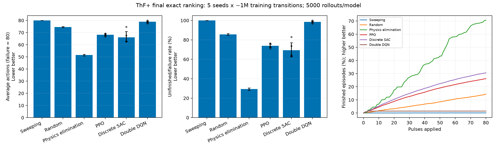

Order is descriptive: exact failure rate, then average actions. PPO/DDQN use γ=1; SAC uses γ=0.99 with an entropy bonus, so these are operational performance scores, not equal training objectives.

Learned-policy intervals bootstrap five training-seed means; baseline mean intervals bootstrap rollouts and failure intervals use Wilson bounds. Five seeds do not establish statistical dominance. Inspect individual JSONs and the FNO-to-exact gap before interpreting a learned advantage.
<!-- FINAL_RL_RESULTS_END -->

## Original production FNO versus downloaded `mix` FNO

All entries use the same five-seed, one-million-transition, 5000-exact-rollout contract. Deltas are `mix - original`; negative is better for both exact metrics.

| Controller | Original exact actions | `mix` exact actions | Delta | Original exact failure | `mix` exact failure | Delta |
|---|---:|---:|---:|---:|---:|---:|
| Sweeping | 79.97 | 79.97 | +0.00 | 99.92% | 99.92% | +0.00 pp |
| Random | 74.57 | 74.57 | +0.00 | 85.62% | 85.62% | +0.00 pp |
| Physics elimination | 51.49 | 51.49 | +0.00 | 29.36% | 29.36% | +0.00 pp |
| PPO | 69.07 | 68.15 | -0.92 | 76.75% | 73.89% | -2.86 pp |
| Discrete SAC | 66.83 | 66.07 | -0.76 | 71.69% | 69.41% | -2.28 pp |
| Double DQN | 80.00 | 78.88 | -1.12 | 100.00% | 98.56% | -1.44 pp |

Transfer failure gap is exact failure minus FNO failure. Negative values mean the FNO environment is pessimistic.

| Controller | Original transfer gap | `mix` transfer gap |
|---|---:|---:|
| Sweeping | +0.10 pp | +0.10 pp |
| Random | -2.84 pp | -0.58 pp |
| Physics elimination | -42.40 pp | -33.78 pp |
| PPO | -0.46 pp | +0.05 pp |
| Discrete SAC | -1.75 pp | -2.82 pp |
| Double DQN | +0.40 pp | -0.41 pp |

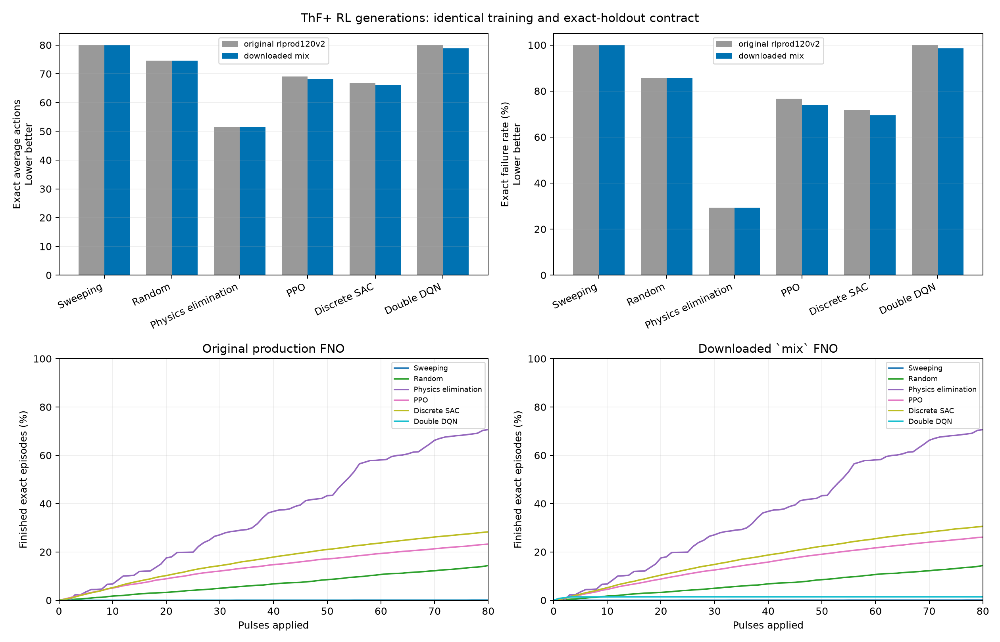

## Metric interpretation

Let $T_j$ be first successful pulse count ($\infty$ if unfinished), $L_j=\min(T_j,H)$, and $N$ rollout count. Early stopping without success still scores failure and $H$.

$$f=1-\frac1N\sum_j\mathbf1\{T_j\le H\},\qquad
A=\frac1N\sum_jL_j,\qquad C(h)=\frac1N\sum_j\mathbf1\{T_j\le h\}.$$

**Failure rate $f$ and average actions $A$: lower better; finished-episode curve $C(h)$: higher better.** Average actions is failure-penalized, not successful-only mean. P85 and worst-10% CVaR of $L$ are lower-better tail metrics, often saturated at80 when failure is high.

Population infidelity $I_p=1-(\sum_b\sqrt{p_b\widehat p_b})^2$: **lower better**, measuring populations, not coherence. Near-pure, identity and conditional-branch errors matter for repeated purification. Speedup $T_{\rm exact}/T_{\rm FNO}$: **higher faster**, but fresh propagation and cached tables are different references. [Precise definitions](docs/FNO_PAPER_METRICS.md).

## Historical pilot — not a final ranking

30-epoch low-width FNO, only8192 training transitions, one seed,200 holdout episodes:

| Controller | Exact average actions ↓ | Exact failure ↓ | FNO average actions | FNO failure |
|---|---:|---:|---:|---:|
| Physics elimination | 51.455 | 28.0% | 80.000 | 100.0% |
| Random | 74.315 | 88.0% | 78.595 | 97.0% |
| PPO | 74.255 | 86.5% | 74.010 | 84.5% |
| Discrete SAC (old temperature) | 73.860 | 85.0% | 77.140 | 93.5% |
| Double DQN | 80.000 | 100.0% | 79.720 | 99.5% |
| Sweeping | 80.000 | 100.0% | 80.000 | 100.0% |

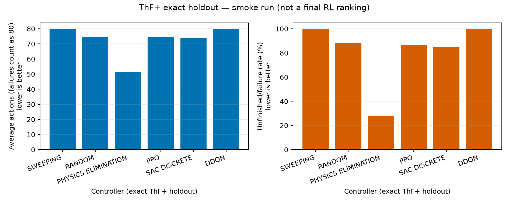

No learned advantage was established. Physics elimination's exact/FNO discrepancy exposed invalid pilot dynamics. Fixed-order sweeping visits only the first80/312 controls before timeout, missing all primitives; it is an order-dependent reference, not optimal sweeping. Raw pilot JSONs are retained for provenance, never pooled with new scores.

## Reports and next work

- [Detailed numerical report](docs/THF_RESULTS.md), [paper-style audit](docs/FNO_PAPER_METRICS.md), [locked RL study](docs/THF_FINAL_RL_STUDY.md).
- Completed: the original and downloaded-`mix` five-seed grids, exact rankings, generation comparison and original-model GPU audits. Next: train paired agents with exact dynamics to separate RL limitations from surrogate bias, and evaluate `mix` on the policy-induced belief/branch distribution before extending training or tuning.
- If peaked/conditional errors persist, train on exact collected beliefs/vertices and test identity/linearity constraints, not just more epochs.
- Add remaining-budget observations; compare exact-trained RL and stronger full-library sweeping schedules.
- Tune hyperparameters only on separate validation seeds after checking model validity; keep final holdout locked. Match discounts for equal-objective claims.

The library lives under src/qlsgym/{molecules,physics,surrogate,env,policies,rl}; scripts/ holds experiments, tests/ correctness checks, results/ JSON/NPZ/figures. Weights, datasets, caches and logs are not committed.
