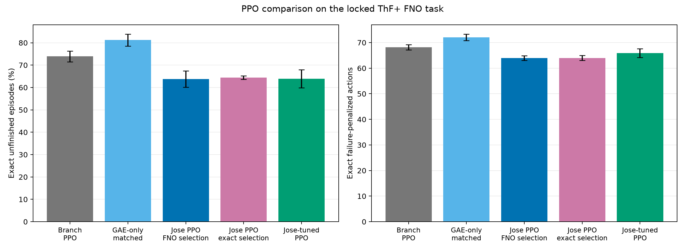

# ThF⁺ FNO–PPO control

This branch compares PPO algorithms for ThF⁺ state purification while holding the molecular model, control library, downloaded FNO, training seeds, and evaluation contract fixed. The PPO implementation and default schedule on `main` are called **Jose PPO** here.

The current result is clear: **Jose PPO outperforms the original PPO on this branch**, although neither PPO is yet competitive with physics elimination.

## Locked control problem

The molecular belief at time $t$ is

$$
s_t \in \Delta^{191}
  = \left\{s \in \mathbb{R}_{\ge 0}^{192}: \sum_{i=1}^{192}s_i=1\right\}.
$$

The action set $\mathcal{A}$ has 312 controls: 288 Raman pulses and 24 primitive operations. For action $a_t\in\mathcal{A}$, the measurement outcome is $k\in\{0,1\}$. Its Born probability and normalized posterior are

$$
\pi_{t,k}=\sum_i u_{t,k,i},
\qquad
s'_{t,k}=\frac{u_{t,k}}{\pi_{t,k}},
\qquad
\sum_{k=0}^{1}\pi_{t,k}=1.
$$

Here $u_{t,k}$ is the unnormalized population vector for branch $k$. The environment samples one posterior $s_{t+1}=s'_{t,K_t}$ with $K_t\sim\{\pi_{t,0},\pi_{t,1}\}$.

An episode succeeds at

$$
T=\inf\left\{t:\lVert s_t\rVert_\infty\ge 0.98\right\}
$$

and is truncated after $H=80$ actions. All experiments use $\rho=0$ and the downloaded `munozariasjm/thf_qls_fno` `mix` manifest: 24 of 24 block-polarization checkpoints, fingerprint `d7deb43457d3`.

For evaluation episode $j$, define $L_j=\min(T_j,H)$, with $T_j=\infty$ for failure. The two ranking metrics under exact dynamics $E$ are

$$
f_E=\frac{1}{N}\sum_{j=1}^{N}\mathbf{1}\{T_j>H\},
\qquad
A_E=\frac{1}{N}\sum_{j=1}^{N}L_j.
$$

Both are lower-better. $A_E$ is failure-penalized: every unfinished episode contributes 80 actions.

## PPO comparison

Every learned row was trained on the same downloaded FNO. Each seed was evaluated with 5,000 FNO episodes and a disjoint 5,000-episode exact holdout. Values below are mean ± sample standard deviation across training seeds. The policy remains stochastic during evaluation.

| PPO | Seeds | Exact failure $f_E$ ↓ | Exact actions $A_E$ ↓ | FNO failure ↓ | Paired $\Delta f_E$ vs branch | Paired $\Delta A_E$ vs branch |
|---|---:|---:|---:|---:|---:|---:|
| Branch PPO | 5 | 73.89% ± 2.37% | 68.15 ± 1.01 | 73.84% | — | — |
| Standard-GAE-only matched control | 5 | 81.21% ± 2.68% | 72.10 ± 1.24 | 80.50% | +7.32 pp | +3.95 |
| **Jose PPO, FNO-selected** | **5** | **63.74% ± 3.64%** | **63.98 ± 0.89** | **62.82%** | **−10.14 pp** | **−4.17** |
| Jose PPO, exact-selected diagnostic | 3 | 64.39% ± 0.76% | 64.02 ± 1.02 | 63.57% | −7.89 pp | −3.50 |
| Jose-tuned PPO, FNO-selected | 5 | 63.91% ± 4.07% | 65.89 ± 1.74 | 60.51% | −9.98 pp | −2.26 |



The [machine-readable summary](results/thf_jose_ppo_comparison/summary.json) contains all configurations and paired effects. The [compact table](results/thf_jose_ppo_comparison/summary.md) is generated from the raw run records.

Jose PPO wins both exact metrics on every paired seed. Its FNO-to-exact failure gap is only $+0.93$ percentage points, so this improvement is not an artifact of reporting performance only inside the surrogate.

The exact-selected diagnostic does not improve Jose PPO. On its three shared seeds, selecting snapshots with exact dynamics changes exact failure by $+0.25$ percentage points and actions by $+0.03$ relative to FNO selection. The exact simulator should therefore remain a disjoint final audit rather than part of model selection.

The result published on `main`—99% success and 124.05 mean pulses for FNO-trained PPO—is not numerically comparable. It uses $H=800$, $\rho=2$, one training seed, and 200 evaluation episodes. The table above deliberately re-runs Jose PPO under this branch's $H=80$, $\rho=0$, five-seed contract.

## Why Jose PPO is better

The actor objective is the usual clipped PPO loss. For the sampled transition, standard GAE uses

$$
\delta_t
=\widetilde r_t+\gamma c_tV(s_{t+1})-V(s_t),
$$

$$
\widehat A_t
=\sum_{\ell\ge 0}(\gamma\lambda)^\ell
\left(\prod_{m=0}^{\ell-1}c_{t+m}\right)\delta_{t+\ell},
$$

where $\widetilde r_t$ is the scaled reward and $c_t=1$ only if the sampled transition is nonterminal and remains inside the action budget.

Branch PPO replaces the sampled one-step residual with the two-outcome expectation

$$
\overline\delta_t
=\sum_{k=0}^{1}\pi_{t,k}
\left[\widetilde r_{t,k}+\gamma c_{t,k}V(s'_{t,k})\right]-V(s_t),
$$

then accumulates these residuals along the sampled trajectory. This estimator is named `qmdp_gae` in the code.

The matched control changes only `qmdp_gae` to standard GAE. It raises exact failure by 7.32 percentage points. **Standard GAE is therefore not the source of Jose PPO's gain.**

| Parameter | Branch PPO | Jose PPO |
|---|---:|---:|
| Value target | `qmdp_gae` | `gae` |
| Learning rate | $3\times10^{-4}$ | $10^{-3}$ |
| Training transitions | $10^6$ | $2\times10^6$ |
| Parallel environments | 128 | 256 |
| Samples per update | 4,096 | 8,192 |
| Network | $192\to256\to256$ | $192\to256\to256$ |
| Snapshot interval | final update only | every 25 updates |

Both schedules perform 245 PPO updates. Jose PPO sees twice as many transitions per update, uses a 3.33-times larger learning rate, and chooses among ten FNO validation snapshots instead of accepting only the final network. The experiments establish that this **joint schedule** is responsible for the improvement; they do not isolate one of these three changes as the cause.

The previous Optuna profile is not better than Jose PPO: its exact failure is statistically similar, but it uses 1.91 more actions and has a larger FNO-to-exact failure gap. Jose PPO is therefore the best tested PPO baseline for this task.

## Better PPO design

The next study should start from Jose PPO and change one factor at a time on paired seeds:

1. Use $2\times10^6$ transitions and FNO-only snapshot selection for every candidate.
2. Run a $2\times2$ ablation of learning rate $\{3\times10^{-4},10^{-3}\}$ and batch size $\{4096,8192\}$.
3. Compare `gae` and `qmdp_gae` under the winning Jose schedule. The present GAE control was tested only under the weaker branch schedule.
4. Test a branch-aware auxiliary critic without forcing branch expectation into the actor advantage:

$$
\overline y_t
=\sum_{k=0}^{1}\pi_{t,k}
\left[\widetilde r_{t,k}+\gamma c_{t,k}V(s'_{t,k})\right],
$$

$$
\mathcal{L}_V
=\left(V(s_t)-y_t^{\mathrm{GAE}}\right)^2
+\beta\left(V(s_t)-\overline y_t\right)^2,
\qquad
\beta\in\{0,0.1,0.3,1\}.
$$

This preserves Jose PPO's sampled policy-gradient estimator while using both exactly enumerated measurement branches to regularize the value function. Setting $\beta=0$ reproduces Jose PPO and makes the test falsifiable.

Select configurations by FNO validation failure, then failure-penalized actions. Report only once on disjoint exact rollouts. Use at least five training seeds and retain paired seed differences. A candidate should replace Jose PPO only if it lowers exact failure without increasing $A_E$.

## Limits of the current result

Jose PPO is the strongest tested PPO, but physics elimination remains substantially better on the same exact evaluation: 29.36% failure and 51.49 actions. The downloaded FNO is also not globally certified. Physics elimination has a 33.78-percentage-point FNO-to-exact failure gap even though Jose PPO's gap is small, showing that agreement on one learned policy does not prove accuracy over all relevant beliefs and actions.

Use the [downloaded-FNO study](results/thf_rl_mix_tara/summary.md) for the PPO, SAC, DDQN, and non-ML ranking. See [FNO metrics](docs/FNO_PAPER_METRICS.md) for single-pulse, branch-normalization, identity, linearity, and timing tests.

## Reproduce

Python 3.11 or newer and PyTorch 2.3 or newer are expected.

```bash
python -m pip install -e '.[gym,fno,analysis,test]'
export QLSGYM_WORK=/path/to/qlsgym_work
export PYTHONPATH="$PWD/src"
```

Run one Jose PPO seed with FNO-only snapshot selection:

```bash
python scripts/thf_rl_agents.py run \
  --agent ppo --preset final \
  --ppo-profile jose_main --ppo-selection fno \
  --manifest "$QLSGYM_WORK/checkpoints/thf/mix.json" \
  --fno-tag mix --min-manifest-coverage 1.0 \
  --seed 0 --device cuda:0 --eval-batch 128 \
  --output results/thf_jose_ppo_comparison/runs
```

Run the resumable two-GPU comparison and regenerate the summary:

```bash
GPU0=0 GPU1=2 bash scripts/run_thf_jose_ppo_comparison.sh
```

The runner uses only the two specified physical GPUs. Raw models, logs, and per-seed records remain untracked; the audited aggregate JSON, Markdown table, and figure are committed.

Run the focused PPO checks with

```bash
python -m pytest -q \
  tests/test_rl_ppo.py \
  tests/test_ppo_qmdp_gae.py \
  tests/test_final_study.py
```
