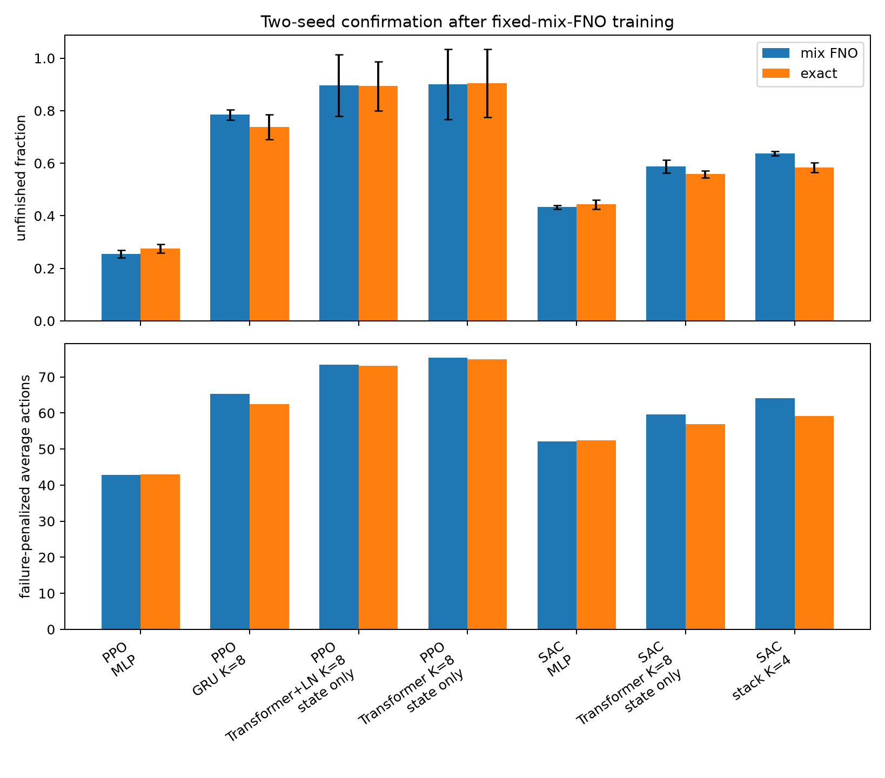
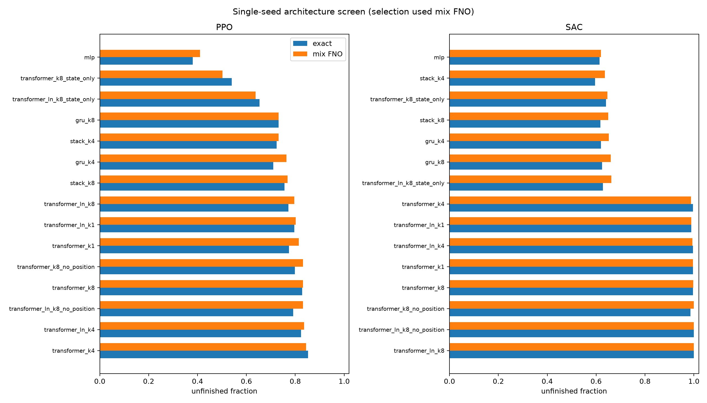

# Sequence-aware PPO and SAC for ThF⁺ control

`FNO_seqRL` tests whether histories of post-measurement molecular beliefs improve
PPO or categorical SAC under the fixed downloaded
[`munozariasjm/thf_qls_fno`](https://huggingface.co/munozariasjm/thf_qls_fno)
`mix` dynamics. It branches from `FNO_RL_optuna` and compares frame stacks,
GRUs, and causal Transformers with matched MLP controls.

The result is unambiguous for the nominal environment: every confirmed
sequence encoder performs worse than its MLP at the same transition budget and
training seeds. The MLP remains the supported architecture.

## State and history

At decision step $t$, let

$$
s_t\in\Delta^{191},
\qquad
a_t\in\{0,\ldots,311\},
\qquad
k_t\in\{0,1\}
$$

denote the post-measurement population belief, pulse, and measurement branch.
The remaining-budget coordinate is $b_t=(80-t)/80$. A context of length $K$ is

$$
H_t=(x_{t-K+1},\ldots,x_t),
$$

with token

$$
x_i=E_s(\sqrt{s_i})+E_a(a_{i-1})+E_k(k_{i-1})+E_b(b_i)
+E_{\mathrm{phys}}(\alpha_{i-1})+E_{\mathrm{pos}}(i).
$$

Here $\alpha(a)$ contains normalized pulse frequency and duration, polarization,
and a primitive-pulse indicator. The implementation provides frame-stack, GRU,
and pre-norm causal-Transformer encoders. Episode resets clear every history.

PPO rollouts and SAC replay preserve separate counterfactual histories for both
measurement outcomes. Their branch-expected target remains

$$
y_t=\sum_{k=0}^{1}p_{t,k}
\left[r_{t,k}+\gamma c_{t,k}V(H_{t+1}^{(k)})\right].
$$

Thus the experiment changes only the observation encoder; it does not replace
the physical two-branch Bellman operator.

## Why history is not expected to help

The full posterior belief and remaining budget already define a Markov state:

$$
P(s_{t+1},r_t\mid s_{0:t},a_{0:t})
=P(s_{t+1},r_t\mid s_t,a_t).
$$

Continuity during one coherent pulse is represented inside the FNO dynamics.
Projective measurement then produces the next posterior $s_{t+1}$. Under this
model, earlier beliefs contain no additional control information. History can
help only when the observation omits a persistent variable, such as detuning
drift, finite-shot uncertainty, or residual motional memory.

## Experiment and result

The bounded study trained 44 policies on Tara GPUs 0 and 2. The screen covered
$K\in\{1,4,8\}$, frame stacks, GRUs, full-token Transformers, state-only
Transformers, positional ablations, and token-LayerNorm ablations. Candidate
selection used FNO validation; exact cached dynamics were held out for transfer
evaluation. Confirmations used the same two training seeds and 2,000 FNO plus
2,000 exact episodes per seed.

For first successful pulse count $T$ and horizon $H=80$, the primary exact
metrics are

$$
f_E=P_E(T>H),
\qquad
A_E=\mathbb E_E[\min(T,H)].
$$

Lower values are better. Results are means over the two confirmation seeds.

| Agent | Encoder | $f_E$ | $A_E$ | Failure change from MLP | Action change |
|---|---|---:|---:|---:|---:|
| PPO | **MLP** | **27.53%** | **42.91** | 0 | 0 |
| PPO | GRU, $K=8$ | 73.78% | 62.51 | +46.25 pp | +19.60 |
| PPO | Transformer, $K=8$, state only | 90.50% | 74.91 | +62.98 pp | +32.00 |
| PPO | Transformer + token LN, $K=8$, state only | 89.35% | 73.07 | +61.82 pp | +30.16 |
| SAC | **MLP** | **44.38%** | **52.46** | 0 | 0 |
| SAC | Transformer, $K=8$, state only | 55.85% | 56.99 | +11.48 pp | +4.53 |
| SAC | Frame stack, $K=4$ | 58.40% | 59.17 | +14.03 pp | +6.71 |

Every paired confirmation seed favors the MLP in both metrics. Full-token SAC
Transformers collapse to nearly deterministic policies and fail 98.8%–100% of
screen episodes. Token LayerNorm does not correct the collapse. Removing action,
outcome, and pulse-feature embeddings prevents the immediate collapse, but the
state-only Transformer still loses to the MLP.





These values should be compared only within the matched experiment. The MLP
means use two new seeds and different budgets from older `FNO_RL_optuna` runs;
their numerical difference from historical five-seed means is not an
architecture improvement.

Sequence models should be reconsidered only after defining a partially observed
problem, for example latent detuning drift

$$
\delta\omega_{t+1}=\rho_\omega\delta\omega_t+\epsilon_t,
$$

finite-shot estimates of $s_t$, or residual motional memory. Such an experiment
should retain an explicit current-state residual path and compare equal
transition budgets.

## Reproduce

On Tara, with the downloaded manifest installed as
`$QLSGYM_WORK/checkpoints/thf/mix.json`:

```bash
cd /home/htseng/qlsgym_FNO_seqRL
source /usr/local/anaconda3/etc/profile.d/conda.sh
conda activate qlsgym
export QLSGYM_WORK=$HOME/qlsgym_work
export PYTHONPATH=$PWD/src

CUDA_VISIBLE_DEVICES=0 python scripts/run_thf_sequence_rl.py run-agent ppo \
  --device cuda --output results/thf_sequence_rl_mix \
  --screen-steps 100000 --confirm-steps 300000

CUDA_VISIBLE_DEVICES=2 python scripts/run_thf_sequence_rl.py run-agent sac \
  --device cuda --output results/thf_sequence_rl_mix \
  --screen-steps 40000 --confirm-steps 100000

python scripts/run_thf_sequence_rl.py summarize \
  --output results/thf_sequence_rl_mix
```

The manifest contract fixes fingerprint `d7deb43457d3`, 24 block/polarization
pairs, 192 states, and 312 actions.

## Repository map

- [`src/qlsgym/rl/sequence.py`](src/qlsgym/rl/sequence.py): episode-safe history buffers and encoders.
- [`src/qlsgym/rl/ppo.py`](src/qlsgym/rl/ppo.py): PPO integration and branch histories.
- [`src/qlsgym/rl/off_policy.py`](src/qlsgym/rl/off_policy.py): categorical SAC integration and replay histories.
- [`scripts/run_thf_sequence_rl.py`](scripts/run_thf_sequence_rl.py): screen, confirmation, resume, and summary workflow.
- [`docs/THF_SEQUENCE_RL_STUDY.md`](docs/THF_SEQUENCE_RL_STUDY.md): full protocol and interpretation.
- [`results/thf_sequence_rl_mix/`](results/thf_sequence_rl_mix): compact contract, selected configurations, summaries, and figures.

Model checkpoints and per-run logs are generated locally and are not committed.
