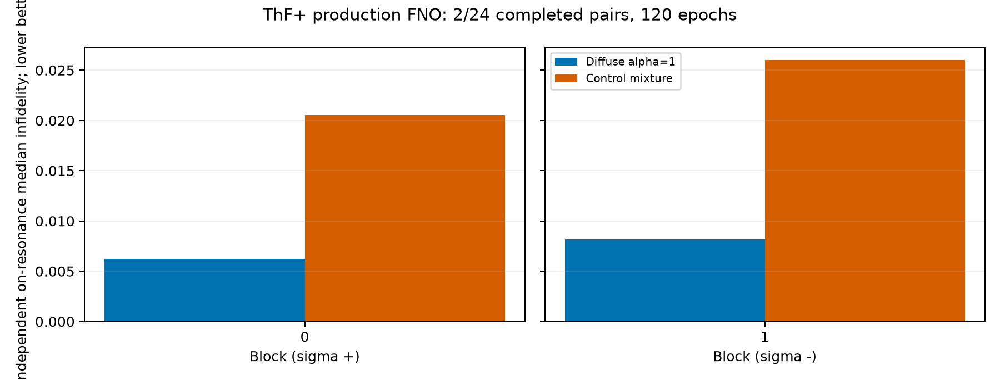

# ThF+ FNO and RL results

This report is regenerated from tracked numerical artifacts. Training weights/caches remain on the server. It adapts metrics from [arXiv:2608.03702](https://arxiv.org/pdf/2608.03702), not its molecule or hardware.

## Main interpretation

ThF+ has 192 molecular states, 12 Hamiltonian blocks, seven retained motional levels, and 312 controls (288 Raman + 24 exact primitives). Purification target is 0.98, horizon 80, temperature 4 K, and maximum Raman duration 6 ms. FNO replaces Raman propagation; primitives remain exact.

The early 8192-transition pilot did not establish a learned advantage: exact physics elimination achieved 51.455 average actions and 28% failure, versus PPO/SAC ~74 actions and 85–86.5% failure; sweeping failed 100%. Its surrogate incorrectly predicted 100% failure for physics elimination. Historical SAC also used an inconsistent entropy scale, corrected in the final grid.

Those are feasibility results only. A final learned ranking requires the locked complete grid and exact hold-out evaluation.

## Production FNO accuracy

Completed checkpoints with independent held-out tests: **2/24**. All completed models trained for 120 epochs; checkpoints are preselected `best_onres.pt`, never test-selected.

| Block | σ | On-resonance median infidelity, diffuse ↓ | On-resonance median, control mixture ↓ | Control-mixture P95 ↓ | Static/no-change median |
|---:|:---:|---:|---:|---:|---:|
| 0 | + | 0.00622 | 0.02051 | 0.02180 | 0.17603 |
| 1 | - | 0.00817 | 0.02600 | 0.02715 | 0.17144 |

Each row uses 32 new frequencies per stratum × 128 initial states, seeds 20260916/17, with 200 single-pulse time samples. Values average over initial states and pulse times before computing frequency percentiles. Diffuse and peaked input ensembles are not interchangeable.

Accuracy on resonance improved strongly over the 30-epoch pilot, but a few-percent error floor remains on peaked beliefs. Off-resonance static predictions can outperform FNO; small unconditional error does not guarantee accurate normalized measurement branches or closed-loop purification.

## Final RL ranking

**Pending, not a completed ranking.** The tmux pipeline waits for all 24 production models, then runs three baselines plus PPO, categorical SAC and DDQN × seeds 0–4 at ~1M transitions each. Every controller has 5000 exact and 5000 FNO rollouts. No pilot/smoke scores are pooled into this ranking.

## What to improve next

1. If near-pure/branch errors remain large, prioritize FNO fidelity: train on exact collected beliefs and simplex vertices, enforce τ=0 identity and input linearity, and validate measurement-conditioned errors. More epochs alone may not remove softmax leakage.
2. Add a time-to-go feature to all critics/actors for the true finite-horizon task; current belief-only stationary policies do not distinguish identical beliefs with different remaining budgets.
3. Separate representation/control effects from RL optimization: test equal-action sweeping schedules, physics-informed action priors, and exact-trained RL controls. Current fixed-order sweeping uses only the first 80/312 actions before timeout.
4. Only after surrogate validity is checked, use a separate validation-seed Optuna search for PPO entropy/learning rate, DDQN exploration/target timescale, and SAC temperature/target entropy. Do not tune on the final 5000-rollout holdout.
5. Repeat matched-γ comparisons or report performance/objective differences explicitly; SAC's γ=0.99 soft objective is not the γ=1 shortest-path objective.

## Provenance and scope

Native qlsgym branch starts from main `2a7ee186f09c54b78d5987bcd0a6bb2399749e28`. FNO/RL experiment code and historical numerical records were selectively ported from HHTseng/rl_qls_paper_replication `FNO_RL_agents`, commit `d306d34`; unrelated molecule experiments/history were not merged.

Production status: still training. Missing pairs: `[[1, '+'], [2, '+'], [3, '+'], [4, '+'], [5, '+'], [6, '+'], [7, '+'], [8, '+'], [9, '+'], [10, '+'], [11, '+'], [0, '-'], [2, '-'], [3, '-'], [4, '-'], [5, '-'], [6, '-'], [7, '-'], [8, '-'], [9, '-'], [10, '-'], [11, '-']]`. See [metric definitions](FNO_PAPER_METRICS.md) and [locked full study](THF_FINAL_RL_STUDY.md).
