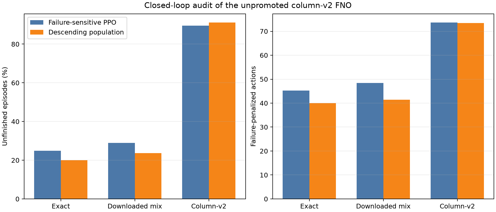

# Closed-loop column-v2 FNO audit

`column_v2` failed the 24-pair structural gate; these results are diagnostic and were not used for training.

| Controller | Exact failure | Exact actions | Mix failure | Mix actions | Column-v2 failure | Column-v2 actions |
|---|---:|---:|---:|---:|---:|---:|
| Failure-sensitive PPO | 24.92% | 45.20 | 28.98% | 48.40 | 89.51% | 73.62 |
| Descending population | 19.98% | 40.00 | 23.68% | 41.44 | 91.10% | 73.40 |

