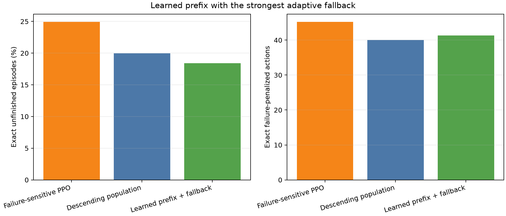

# Learned-prefix and descending-population hybrid

Selected learned prefix: 15 pulses.

| Controller | Exact failure | Exact actions | FNO failure | FNO actions |
|---|---:|---:|---:|---:|
| Failure-sensitive PPO | 24.92% | 45.20 | 28.98% | 48.40 |
| Descending population | 19.98% | 40.00 | 23.68% | 41.44 |
| Learned prefix + fallback | 18.40% | 41.31 | 22.84% | 42.97 |

Mean dominates descending population on both exact metrics: False.
Paired superiority rule is supported: False.
Failure difference (hybrid - descending): -1.58 pp (95% seed CI -2.01 to -1.15); action difference 1.31.
Across 25,000 paired rollouts: 1,719 rescued and 1,324 lost.

