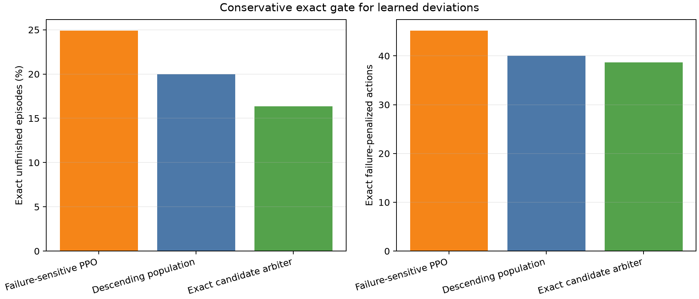

# Conservative exact candidate arbiter

| Controller | Exact failure | Exact actions | FNO failure | FNO actions |
|---|---:|---:|---:|---:|
| Failure-sensitive PPO | 24.92% | 45.20 | 28.98% | 48.40 |
| Descending population | 19.98% | 40.00 | 23.68% | 41.44 |
| Exact candidate arbiter | 16.37% | 38.70 | 19.38% | 39.94 |

Mean dominates descending population on both exact metrics: True.
Paired superiority rule is supported: True.
Failure difference (arbiter - descending): -3.61 pp (95% seed CI -4.75 to -2.47); action difference -1.30.
Across 25,000 paired rollouts: 1,478 rescued and 576 lost.

