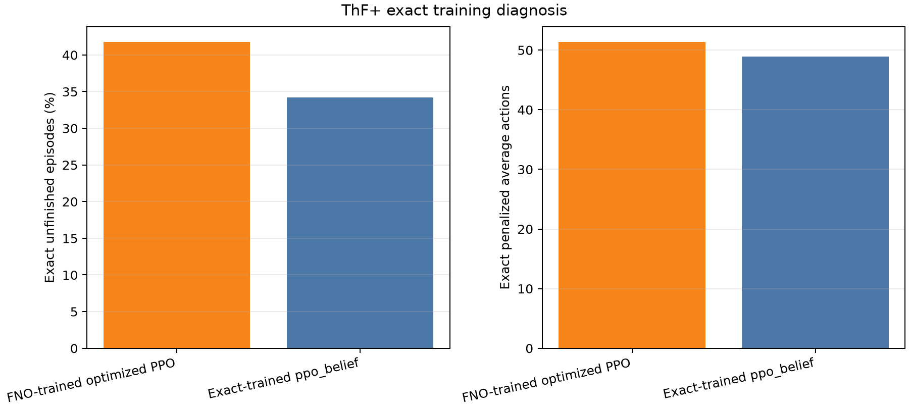

# ThF+ exact-training diagnosis

Five fresh seeds were trained for one million transitions with cached exact action tables. Each seed was evaluated on 5,000 exact and 5,000 downloaded-`mix` FNO episodes.

| Run | Exact failure | Exact actions | FNO failure | FNO actions |
|---|---:|---:|---:|---:|
| FNO-trained optimized PPO | 41.78% | 51.37 | 38.90% | 50.86 |
| Exact-trained ppo_belief | 34.23% ± 6.32 | 48.88 ± 2.02 | 40.16% ± 6.74 | 54.11 ± 1.84 |

Exact failure improvement: +7.54 points.
Exact action improvement: +2.49.

The exact-trained policy's FNO score measures whether the surrogate preserves a stronger policy's visited distribution; it is not used to rank the controller.

