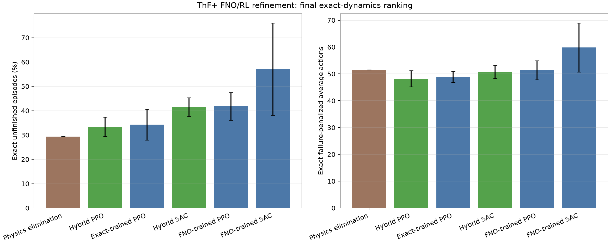

# ThF+ FNO/RL refinement

Policies are ranked by exact failure, then exact failure-penalized actions.

| Rank | Controller | Training | Exact failure | Exact actions | FNO failure | FNO actions |
|---:|---|---|---:|---:|---:|---:|
| 1 | Physics elimination | exact model-based baseline | 29.36% | 51.49 | 63.14% | 64.52 |
| 2 | Hybrid PPO | mix FNO pretraining + 250k exact | 33.44% | 48.21 | 36.35% | 50.71 |
| 3 | Exact-trained PPO | 1M cached-exact | 34.23% | 48.88 | 40.16% | 54.11 |
| 4 | Hybrid SAC | mix FNO pretraining + 250k exact | 41.52% | 50.70 | 43.48% | 52.23 |
| 5 | FNO-trained PPO | 1M downloaded mix | 41.78% | 51.37 | 38.90% | 50.86 |
| 6 | FNO-trained SAC | 1M downloaded mix | 57.07% | 59.85 | 56.59% | 59.49 |

Downloaded `mix` pairs passing every structural gate: **0/24**.
Transfer-column pilot decision: **stop**; the 24-pair retrain was not run.

