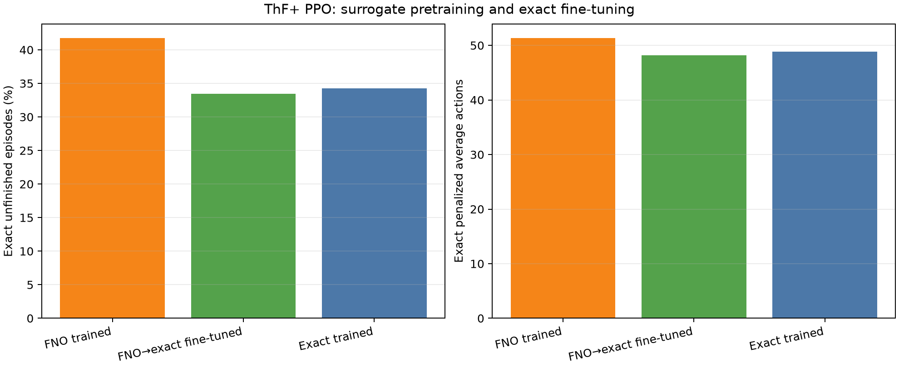

# ThF+ PPO hybrid exact fine-tuning

| Training | Exact failure | Exact actions |
|---|---:|---:|
| FNO trained | 41.78% | 51.37 |
| FNO→exact fine-tuned | 33.44% | 48.21 |
| Exact trained | 34.23% | 48.88 |

