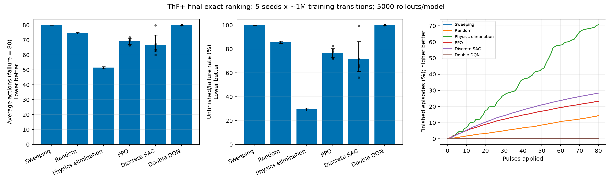

## Final exact-simulator ranking

Complete locked grid: 15 learned policies and three baselines. Each policy has 5000 exact and 5000 surrogate rollouts.

| Controller | Training seeds | Exact average actions ↓ (95% CI) | Exact failure ↓ (95% CI) | FNO average actions | FNO failure |
|---|---:|---:|---:|---:|---:|
| Physics elimination | 0 | 51.49 [50.78, 52.22] | 29.36% [28.11, 30.64] | 69.20 | 71.76% |
| Discrete SAC | 5 | 66.83 [62.10, 73.37] | 71.69% [61.18, 86.19] | 68.19 | 73.44% |
| PPO | 5 | 69.07 [67.17, 70.97] | 76.75% [73.14, 80.36] | 69.80 | 77.21% |
| Random | 0 | 74.57 [74.11, 75.01] | 85.62% [84.62, 86.57] | 76.18 | 88.46% |
| Sweeping | 0 | 79.97 [79.94, 80.00] | 99.92% [99.79, 99.97] | 79.93 | 99.82% |
| Double DQN | 5 | 80.00 [80.00, 80.00] | 100.00% [100.00, 100.00] | 79.86 | 99.60% |

Order is descriptive: exact failure rate, then average actions. PPO/DDQN use γ=1; SAC uses γ=0.99 with an entropy bonus, so these are operational performance scores, not equal training objectives.

Learned-policy intervals bootstrap five training-seed means; baseline mean intervals bootstrap rollouts and failure intervals use Wilson bounds. Five seeds do not establish statistical dominance. Inspect individual JSONs and the FNO-to-exact gap before interpreting a learned advantage.
