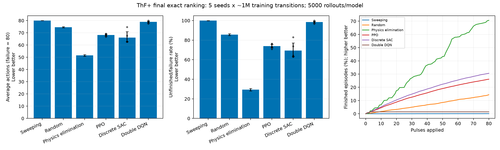

## External `mix` FNO exact-simulator ranking

Complete locked grid: 15 learned policies and three baselines. Each policy has 5000 exact and 5000 surrogate rollouts.

| Controller | Training seeds | Exact average actions ↓ (95% CI) | Exact failure ↓ (95% CI) | FNO average actions | FNO failure |
|---|---:|---:|---:|---:|---:|
| Physics elimination | 0 | 51.49 [50.78, 52.22] | 29.36% [28.11, 30.64] | 64.52 | 63.14% |
| Discrete SAC | 5 | 66.07 [62.67, 70.87] | 69.41% [63.28, 77.18] | 68.03 | 72.23% |
| PPO | 5 | 68.15 [67.39, 68.91] | 73.89% [72.12, 75.67] | 69.14 | 73.84% |
| Random | 0 | 74.57 [74.11, 75.01] | 85.62% [84.62, 86.57] | 75.91 | 86.20% |
| Double DQN | 5 | 78.88 [78.03, 79.58] | 98.56% [97.48, 99.46] | 79.69 | 98.97% |
| Sweeping | 0 | 79.97 [79.94, 80.00] | 99.92% [99.79, 99.97] | 79.94 | 99.82% |

Order is descriptive: exact failure rate, then average actions. PPO/DDQN use γ=1; SAC uses γ=0.99 with an entropy bonus, so these are operational performance scores, not equal training objectives.

Learned-policy intervals bootstrap five training-seed means; baseline mean intervals bootstrap rollouts and failure intervals use Wilson bounds. Five seeds do not establish statistical dominance. Inspect individual JSONs and the FNO-to-exact gap before interpreting a learned advantage.
