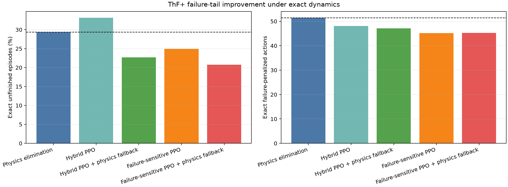

# ThF+ FNO-assisted safe-hybrid study

Primary order: exact unfinished fraction, then exact failure-penalized actions.

| Controller | Exact unfinished | Exact actions | FNO unfinished | FNO actions |
|---|---:|---:|---:|---:|
| Physics elimination | 29.36% | 51.49 | 63.14% | 64.52 |
| Hybrid PPO | 33.16% | 48.09 | 35.58% | 50.41 |
| Hybrid PPO + physics fallback | 22.70% | 47.15 | 37.59% | 50.69 |
| Failure-sensitive PPO | 24.92% | 45.20 | 28.98% | 48.40 |
| Failure-sensitive PPO + physics fallback | 20.72% | 45.25 | 36.01% | 49.54 |

The summary JSON contains seed standard deviations, seed-level confidence intervals, paired rescue/loss counts, and both promotion decisions.

